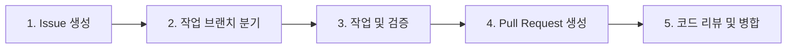

# bokji-agent 협업 가이드 (Contribution Guide)

`bokji-agent` 프로젝트의 코드 품질과 원활한 협업을 위한 기여 가이드라인입니다.  
불필요한 형식적 제약보다는 **작업 목적의 명확성, 작은 단위의 변경, 그리고 신뢰할 수 있는 검증**을 최우선으로 합니다.

---

## 🎯 개발 및 협업 기본 원칙

1. **작은 단위의 집중된 작업 (Single Responsibility)**
   - 하나의 Issue / Branch / PR은 하나의 명확한 목적만 다룹니다.
   - 변경 범위가 넓어질수록 충돌 위험과 리뷰 비용이 증가합니다.
2. **실행 가능한 검증 결과 제시**
   - 모든 기능 변경 및 버그 수정은 로컬 실행 또는 테스트 코드를 통해 동작을 검증한 후 PR을 생성합니다.
   - PR 본문에 검증 방식과 결과(로그, 스크린샷 등)를 명시합니다.
3. **공용 인터페이스의 안정성 유지**
   - 여러 모듈이 공유하는 상태 스키마(`state.py` 등)는 사전에 팀 내 공유 및 검토를 거쳐 수정합니다.
4. **보안 및 환경 격리**
   - API Key, 환경변수(`.env`), 개인정보 및 원문 데이터는 저장소에 절대 커밋하지 않습니다.

---

## 🔄 워크플로우 (Workflow)



1. **Issue 등록**: 작업할 내용의 배경, 세부 항목, 완료 조건을 이슈로 등록합니다.
2. **브랜치 생성**: 최신 `main` 브랜치에서 작업 브랜치를 분기합니다.
3. **작업 및 커밋**: 논리적 변경 단위로 작게 커밋하고 자체 검증을 완료합니다.
4. **PR 생성**: 제공된 PR 템플릿에 따라 변경 내용과 검증 결과를 작성합니다.
5. **리뷰 및 병합**: 팀원 1명 이상의 승인을 거쳐 **Squash and Merge** 방식으로 병합합니다.

---

## 🌿 브랜치 전략

- **기본 브랜치**: `main` (직접 push 금지, PR을 통해서만 병합)
- **작업 브랜치 형식**: `<type>/<issue-number>-<short-slug>`
  - 형식: `<유형>/<이슈번호>-<간결한설명>`
  - 예시:
    - `feat/12-search-retriever`
    - `fix/25-token-overflow`
    - `refactor/40-graph-nodes`
- **단위 분할 작업 시**: 하나의 큰 이슈를 하위 컴포넌트별로 나누어 작업할 경우 slug 뒤에 식별자를 추가합니다.
  - 예: `feat/11-eligibility-node`, `feat/11-benefit-calculator`
  - 선행 PR들은 `part of #11`로 참조하고, 최종 PR에서 `closes #11`로 이슈를 종료합니다.

---

## 📝 커밋 메시지 컨벤션 (Conventional Commits)

표준 Conventional Commits 형식을 따르며, 설명은 한국어로 간결하게 작성합니다.

### 형식
```text
<type>(<scope>): <간결한 설명>
```
*`scope`는 생략 가능합니다.*

### Type 종류
| Type | 설명 |
| :--- | :--- |
| **feat** | 새로운 기능 추가 |
| **fix** | 버그 수정 |
| **refactor** | 기능 변경이 없는 코드 구조 개선 및 리팩토링 |
| **test** | 테스트 코드 추가 또는 수정 |
| **docs** | 문서 수정 (README, 가이드 등) |
| **chore** | 빌드 설정, 패키지 의존성 관리, 설정 파일 수정 등 |
| **perf** | 성능 향상을 위한 변경 |

### 작성 예시
```text
feat(graph): 복지 자격 판정 노드 구현
fix: 상태 갱신 시 누락된 필드 기본값 추가
docs: CONTRIBUTING.md 협업 가이드 최신화
refactor: 프롬프트 생성 헬퍼 함수 분리
test: 검색기 임계값 필터링 유닛 테스트 추가
```

---

## 🔀 Pull Request 및 병합 규칙

1. **PR 제목**: 커밋 메시지 컨벤션과 동일한 형식으로 작성합니다.
   - 예: `feat(graph): 복지 자격 판정 노드 추가`
2. **PR 본문**: 기본 PR 템플릿 양식에 맞춰 변경 이유와 검증 내용을 채웁니다.
3. **병합 방식**:
   - 커밋 히스토리의 가독성을 위해 **Squash and Merge**를 기본으로 적용합니다.
   - `main` 브랜치에 대한 강제 푸시(`--force`)는 전면 차단됩니다.

---

## 🧱 프로젝트 아키텍처 규칙 (LangGraph 파이프라인)

`src/rag_chatbot/graph/` 내의 파이프라인 구성 시 아래 구조를 준수합니다:

```text
src/rag_chatbot/graph/
├── __init__.py
├── state.py           # GraphState 공용 스키마 (수정 시 사전 검토 필수)
└── nodes/
    ├── __init__.py     # 노드 함수 re-export
    └── {node_name}.py  # 노드 파일 (1 노드 = 1 파일, snake_case)
```

- **1 노드 = 1 파일**: `nodes/` 디렉터리에 노드 역할을 나타내는 `snake_case` 파일명으로 분리합니다. 파일명에는 가변적인 노드 번호(N1, N2 등)를 포함하지 않습니다. (예: `eligibility_verdict.py`)
- **함수 규격**: `def <동사_명사>(state: GraphState) -> dict:` 형태로 작성하며, **갱신할 상태 필드만 부분 dict(partial dict)**로 반환합니다.
- **`state.py` 관리**: 공용 상태 필드 변경은 기존에 작성된 다른 노드에 영향을 줄 수 있으므로 사전에 공유 후 적용합니다.
- 새 노드 추가 시 `nodes/__init__.py`에 해당 노드 함수를 re-export합니다.
