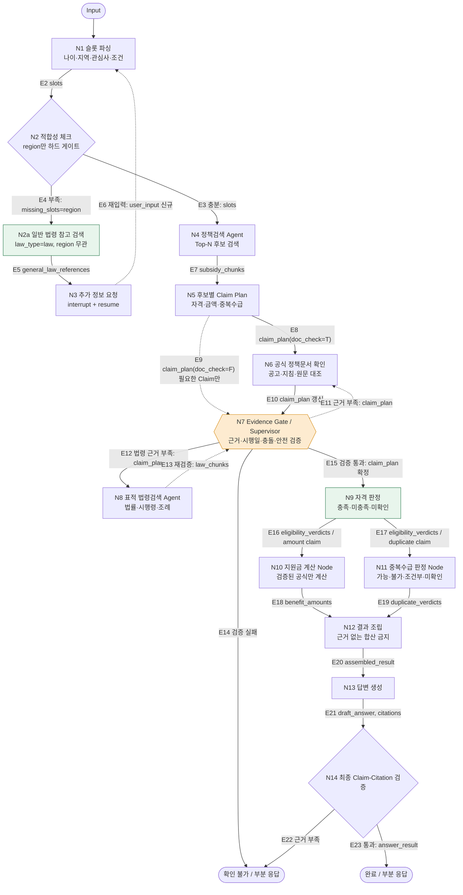

# 복지 에이전트 (bokji-agent)

거주 지역·나이·소득 같은 기본 정보를 대화로 받아, **받을 수 있는 정부 지원 제도**를
찾아 **자격 · 지원금 · 중복수급**을 근거와 함께 알려주는 RAG 질의응답 서비스다.

핵심 원칙은 하나다. **검색된 근거로 확인되는 내용만 답한다.**
근거가 부족하면 추측하지 않고 "미확인"으로 두거나 답변을 보류하고,
공식 페이지(복지로·국가법령정보센터) 확인을 안내한다.

- 데이터: 보조금24(정부24) 지원제도 + 국가법령정보센터 법령 **목록 메타데이터**
- 검색: ChromaDB + `intfloat/multilingual-e5-base` (768차원)
- 추론: LangGraph 14노드 그래프 (N1~N14)
- 화면: Streamlit (`streamlit run app.py`)

---

## 그래프 구조 (N1~N14)

한 번의 질문이 아래 경로를 지난다. 조건부 분기가 있어서 **실제 경로는 실행해봐야
안다** — 되묻고 멈추면 N1~N3에서 끝나고, 근거가 모자라면 N6/N8로 되돌아간다.



<!-- 다이어그램 원본: docs/graph.mmd (mmdc 로 SVG/PNG 렌더 가능) -->

| 노드 | 파일 | 하는 일 |
|---|---|---|
| N1 | `graph/nodes/slot_parser.py` | 발화에서 슬롯 추출 (규칙 + LLM 보정) |
| N2 | `slot_completeness_gate.py` | 하드 게이트 슬롯이 다 찼는지 판정 |
| N2a | `general_law_reference_search.py` | 지역 무관 참고 법령 검색 |
| N3 | `request_missing_slots.py` | 부족한 항목 되묻기 (`interrupt` → `resume`) |
| N4 | `policy_search.py` | 지원제도 후보 검색 (Top-K) |
| N5 | `claim_plan.py` | 정책 원문에서 claim 후보 추출 |
| N6 | `document_verification.py` | 근거가 원문에 실제로 있는지 검증 |
| N7 | `evidence_gate.py` | 근거 충분한지 게이트 (Supervisor) |
| N8 | `targeted_law_search.py` | 선언된 법령 메타데이터 정조준 검색 |
| N9 | `eligibility_verdict.py` | 자격 충족 / 미충족 / 미확인 |
| N10 | `benefit_calculator.py` | 지원금액 계산 |
| N11 | `duplicate_benefit.py` | 중복수급 가능 / 불가 / 조건부 / 미확인 |
| N12 | `result_assembly.py` | 정책별 결과 조립 |
| N13 | `answer_generation.py` | 최종 답변 문장 생성 |
| N14 | `final_verification.py` | 답변 최종 검증 (claim ↔ citation) |

---

## 빠른 시작

Python 3.11 기준.

```bash
git clone https://github.com/SKN33-3rd-3Team/bokji-agent
cd bokji-agent

pip install -r requirements.txt
cp .env.example .env        # 값 채우기 (아래 "환경 변수" 참고)

streamlit run app.py
```

> **사전 구축된 `data/vector_db`가 필요하다.** 샘플 데이터를 자동 색인하지
> 않으므로, 색인이 없으면 화면이 "서비스 데이터베이스가 준비되지 않았습니다"로
> 멈춘다. 색인을 새로 만들려면 아래 "데이터와 색인"을 본다.

`streamlit` 버전은 **1.62.0으로 맞춰야 한다.** 그보다 낮으면
`st.metric(icon=...)`, `st.container(horizontal=True)` 같은 API가 없어
`TypeError: unexpected keyword argument` 로 답변 렌더링이 통째로 실패한다.

```bash
pip install -r requirements-streamlit.txt
python -c "import streamlit; print(streamlit.__version__)"   # 1.62.0
```

### 화면 없이 확인하기

```bash
# 전체 파이프라인을 콘솔에서 한 번 돌려본다(노드별 소요 시간 포함)
python scripts/manual_test_service.py

# 대화형 콘솔 챗
python scripts/interactive_console_chat.py

# LLM 연결만 진단 (토큰/크레딧/provider 중 무엇이 문제인지까지 출력)
python scripts/check_llm_connection.py
```

Windows PowerShell에서 `ModuleNotFoundError: No module named 'rag_chatbot'`가
나면 경로를 잡아준다.

```powershell
$env:PYTHONPATH = ".;src"
```

---

## 환경 변수

`.env.example`를 복사해서 쓴다. **`.env`는 절대 커밋하지 않는다**
(`.gitignore`에 이미 있다).

| 변수 | 필수 | 설명 |
|---|---|---|
| `GOV24_SERVICE_KEY` | 수집 시 | 보조금24 API 키 |
| `LAW_OC` | 수집 시 | 국가법령정보센터 OC |
| `EMBEDDING_PROVIDER` | ✅ | `korean` (운영) / `hash` (오프라인 스모크) |
| `EMBEDDING_MODEL_NAME` | | 기본 `intfloat/multilingual-e5-base` |
| `EMBEDDING_DIMENSION` | | `korean`=768, `hash`=128 |
| `HF_TOKEN` | | HuggingFace Inference API 토큰 |
| `LLM_MODEL_NAME` | | 예: `Qwen/Qwen3.5-9B` |
| `LLM_MAX_NEW_TOKENS` | | **4096 이상 권장** (아래 주의 참고) |
| `LLM_DISABLE_THINKING` | | `1`이면 추론형 모델의 사고 출력을 끄려 시도 |
| `LLM_PREFETCH_WORKERS` | | N5 claim 추출 병렬도 (기본 4, 1~16) |
| `BOKJI_TRACE` | | `1`이면 노드마다 진행 상황을 콘솔에 출력 |
| `AUTH_ENC_KEY` | | 회원 PII 암호화 키 (`python src/rag_chatbot/auth/__main__.py keygen`) |
| `AUTH_DB_PATH` | | 사용자 SQLite 경로 (기본 `.runtime/auth.db`) |

> **`LLM_MAX_NEW_TOKENS`를 낮게 두지 말 것.** 값이 작으면 N13이 답을 다 쓰지
> 못하고 `finish_reason="length"`로 끊긴다. 그런 응답은 실패로 처리해 규칙
> 기반 답변으로 폴백하므로(문장이 중간에 잘려 나가는 것보다 낫다), 값이 낮으면
> LLM 답변이 거의 나오지 않는다. 추론형 모델은 사고 과정에도 토큰을 쓴다.

LLM 관련 값을 아무것도 채우지 않아도 **서비스는 정상 동작한다.** 모든 노드가
규칙 기반/템플릿 경로로 폴백하고, 화면에 "AI 모델을 사용하지 않고 규칙 기반으로
처리했습니다"가 표시된다.

---

## 데이터와 색인

### 원천 문서 (`data/processed/`)

| 파일 | 문서 수 | 크기 |
|---|---:|---:|
| `subsidy_documents.jsonl` | 10,968 | 43.3 MB |
| `law_documents.jsonl` | 190,445 | 396.0 MB |

### 벡터 색인 (`data/vector_db/`, 총 2.9 GB)

같은 디렉터리에 provider별 컬렉션이 따로 산다. 검색과 색인의 provider가 다르면
`ChromaVectorStore`가 fingerprint로 막는다 — **조용히 틀린 결과가 나오지는 않는다.**

| provider | subsidy 청크 | law 청크 | 용도 |
|---|---:|---:|---|
| `sentence-transformers:intfloat/multilingual-e5-base:768` | 60,497 | 111,500 | **운영** (`EMBEDDING_PROVIDER=korean`) |
| `local-hash-v1:128` | 45,413 | 1,465 | 테스트·오프라인 스모크 전용 |

`local-hash-v1`은 문자 n-gram 해시라 **의미를 담지 않는다.** 이 색인으로
검색하면 "혼자 사는데 월세가 부담돼요"에 유기질비료·입양축하금 같은 무관한
정책이 올라온다. 운영에서는 반드시 `korean`을 쓴다.

### 재색인

```bash
pip install sentence-transformers
python scripts/reindex_korean.py            # subsidy + law 전체
python scripts/reindex_korean.py --only law # 빠른 쪽만 먼저
python scripts/reindex_korean.py --smoke-only
```

첫 실행에 임베딩 모델을 약 1GB 내려받고, CPU면 수십 분이 걸린다.
GPU가 있으면 `--device cuda`.

### 법령 데이터의 범위 (의도된 계약)

팀 결정에 따라 **법령 본문·조문은 수집·색인 대상이 아니다.** 국가법령정보센터
목록조회 **메타데이터만** 쓴다(`content_level=metadata_only`). 따라서 법령
문서에 조·항·호·목 locator가 없는 것은 결함이 아니다. 법적 정의·자격·배제를
확정하는 근거로 쓰지 않고, 관련 법령 후보와 공식 상세 페이지 안내로만 쓴다.
자세한 내용은 [`docs/PROJECT_COMPLIANCE.md`](docs/PROJECT_COMPLIANCE.md).

---

## 프로젝트 구조

```
app.py                    Streamlit 진입점 (페이지 설정 → 세션 → 화면 분기)
streamlit_ui/             화면
  ├─ pages/               chat / auth / mypage
  ├─ pipeline.py          공식 서비스 API 어댑터
  ├─ rendering.py         ChatResponse → 위젯 (요약 카드·정책 캐러셀·근거)
  ├─ session.py           세션 상태, Markdown 유틸
  └─ constants.py         한글 라벨·선택지
src/rag_chatbot/
  ├─ service.py           ask() / answer_followup() — 공식 진입점
  ├─ graph/               LangGraph 그래프
  │   ├─ builder.py       노드 배선, run_graph / resume_graph
  │   ├─ nodes/           N1~N14
  │   ├─ slot_schema.py   슬롯 어휘·게이트 등급
  │   └─ llm_gateway.py   슬롯 추출 (규칙 + LLM)
  ├─ llm/client.py        HuggingFace / RunPod 클라이언트, 실패 원인 진단
  ├─ auth/                로그인·회원가입 (bcrypt + Fernet)
  ├─ collectors/          보조금24 · 국가법령정보센터 수집기
  └─ timing.py            노드별 소요 시간 계측
rag_design/               문서·청크·벡터스토어 공용 계약 (수집·UI 팀 공유)
scripts/                  수동 확인·재색인·진단 스크립트
tests/                    33개 파일
docs/                     설계·준수 기준 문서
```

### 응답 계약

`ask()` / `answer_followup()`은 `ChatResponse`(TypedDict)를 돌려준다.
프론트엔드가 같은 결과를 필요한 형식으로 바로 쓸 수 있게 네 벌을 함께 싣는다.

- `policies` — 정책별 구조화 결과 (자격·금액·중복수급·근거·상세)
- `output_json` — 화면과 같은 구성의 JSON (요약 카운트, 파악한 정보, 정책 목록)
- `output_markdown` — 정책 비교 Markdown 표
- `output_text` — 일반 문자열
- `llm_status` — LLM이 실제로 돌았는지 / 몇 번 실패했는지
- `timing` — 노드별 소요 시간과 실제로 지나간 경로

---

## 테스트

```bash
python -m pytest -q
```

현재 **673 passed** (+ subtests 373). Streamlit 화면 테스트는
`streamlit.testing.v1.AppTest`로 실제 위젯 트리를 검사한다.

```bash
python -m pytest -q tests/test_streamlit_rendering.py   # 화면 렌더링
python -m pytest -q tests/test_graph_nodes.py           # 노드 단위
python -m pytest -q tests/test_service.py               # 서비스 계약
```

평가 질문 세트는 `data/evaluation/dev_questions.jsonl`(100건)이고,
자동 평가는 [`docs/EVALUATION_AUTOMATION.md`](docs/EVALUATION_AUTOMATION.md)를 본다.

```bash
python scripts/run_dev_validation.py
```

---

## 알려진 한계

숨기지 않고 적는다 ([`docs/PROJECT_COMPLIANCE.md`](docs/PROJECT_COMPLIANCE.md)의
"한계를 숨기지 않는다").

- **응답이 느리다.** 질문 하나에 수십초가 걸린다. N5가 후보 정책마다 LLM을 한 번씩
  부르는 것이 지배적이다(캐시 + 병렬 호출로 완화했지만 여전히 가장 큰 비용).
  진행 상황은 화면의 진행률 막대와 `BOKJI_TRACE=1` 콘솔 출력으로 볼 수 있다.
- **대화 상태가 프로세스 메모리에만 있다.** LangGraph `MemorySaver`를 쓰므로
  서버를 재시작하면 진행 중이던 되묻기 세션이 사라진다.
- **`TIMER`·`RecordingLLMClient`는 프로세스 전역이다.** 여러 요청이 동시에 돌면
  기록이 섞인다. 요청 단위로 보려면 그 요청만 돌려야 한다.
- **Streamlit 파일 워처를 껐다** (`.streamlit/config.toml`). `transformers`가
  import된 뒤로 워처가 매 실행 종료마다 수십 초 동안 이벤트 루프를 막아 결과가
  화면에 전달되지 않았기 때문이다. 대신 소스를 저장해도 자동 rerun되지 않는다 —
  브라우저에서 새로고침하거나 재시작해야 한다.
- **사이드바의 지원조건·관심 분야는 첫 질문에만 반영된다.** 되묻기 재개 중에는
  체크포인터의 슬롯이 이미 확정돼 있어서 초기 슬롯을 갈아끼우지 않는다.
- **`requirements.txt`는 `streamlit>=1.57`, `requirements-streamlit.txt`는
  `==1.62.0`으로 서로 다르다.** 1.62.0을 쓴다.
- 자격 판정에서 실제로 대조하는 조건은 아직 제한적이다. 대조하지 못한 조건은
  카드에 "확인하지 못한 조건"으로 그대로 표시한다 — "충족"이 "모든 조건 만족"으로
  읽히지 않게 하기 위해서다.

---

## 문서

| 문서 | 내용 |
|---|---|
| [`docs/PROJECT_COMPLIANCE.md`](docs/PROJECT_COMPLIANCE.md) | 프로젝트 준수 기준, Gate 0~6, 법령 데이터 범위 결정 |
| [`docs/graph.mmd`](docs/graph.mmd) | 위 N1~N14 그래프 다이어그램 원본(Mermaid) |
| [`docs/RAG_DESIGN_PLAN.md`](docs/RAG_DESIGN_PLAN.md) | RAG 설계 계획 |
| [`docs/RAG_DESIGN_IMPLEMENTATION.md`](docs/RAG_DESIGN_IMPLEMENTATION.md) | 설계 구현 노트 |
| [`docs/VECTOR_STORE.md`](docs/VECTOR_STORE.md) | 벡터 스토어 계약 |
| [`docs/N7_N8_IMPLEMENTATION_PLAN.md`](docs/N7_N8_IMPLEMENTATION_PLAN.md) | Evidence Gate·표적 법령검색 |
| [`docs/N9_N12_IMPLEMENTATION_PLAN.md`](docs/N9_N12_IMPLEMENTATION_PLAN.md) | 자격·금액·중복수급·조립 |
| [`docs/EVALUATION_AUTOMATION.md`](docs/EVALUATION_AUTOMATION.md) | 평가 자동화 |
| [`docs/PII_LOGGING.md`](docs/PII_LOGGING.md) | PII 로깅 정책 |
| [`docs/RUNPOD_SETUP_DRAFT.md`](docs/RUNPOD_SETUP_DRAFT.md) | RunPod 서빙 초안 |
| [`CONTRIBUTING.md`](CONTRIBUTING.md) | 기여 절차, 브랜치·PR 규칙 |

### Gate 0~6

| Gate | 범위 | 통과 기준 |
|---|---|---|
| 0. 문제 정의 | 사용자·질문·문서 범위·성공 기준 | "누가 어떤 문서로 어떤 질문을 해결하는가"를 한 문장으로 설명 |
| 1. 데이터 | 문서 수집·정제, Document Card, 메타데이터 | 출처·권리·민감정보·중복·파싱 오류 확인 |
| 2. Baseline | Loader·Splitter·Embedding·VectorDB·Retriever·LLM 연결 | 대표 질문에 검색 근거와 답변·출처가 함께 출력 |
| 3. 검색 개선 | chunk size, overlap, k, embedding 비교 | 같은 평가 질문으로 변경 전후 수치·실패 사례 비교 |
| 4. 답변 평가 | 프롬프트·보류 정책·인용 형식 | 근거 없는 단정이 줄고 답변이 문서 근거와 일치 |
| 5. 서비스 | 화면·오류 처리·보안·실행 환경 | 새 환경에서 README만 보고 실행 가능 |
| 6. 최종 검증 | Holdout 평가, 회귀 테스트, 발표 | 성공 사례뿐 아니라 실패 사례·한계·다음 개선도 제시 |

---

## 기여

브랜치는 `type/이슈번호-설명` 형식을 쓴다 (`fix/35-streamlit-result-not-rendered`).
커밋 제목의 type은 `feat, fix, refactor, docs, test, chore, build, ci, perf, style`
중 하나다. 자세한 절차는 [`CONTRIBUTING.md`](CONTRIBUTING.md).

**팀** SKN33-3rd-3Team

