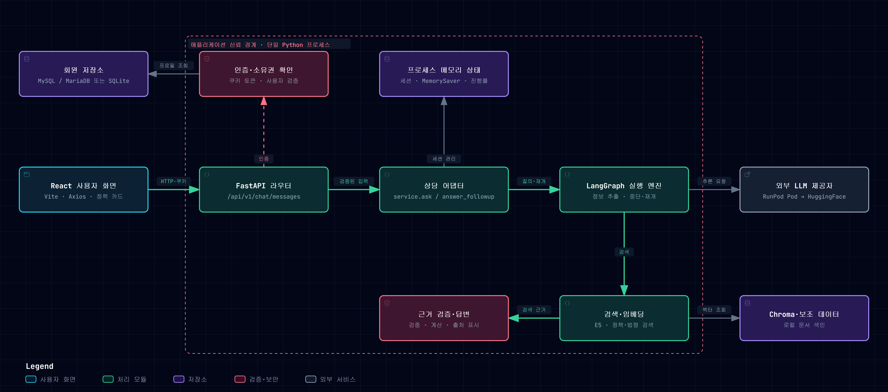
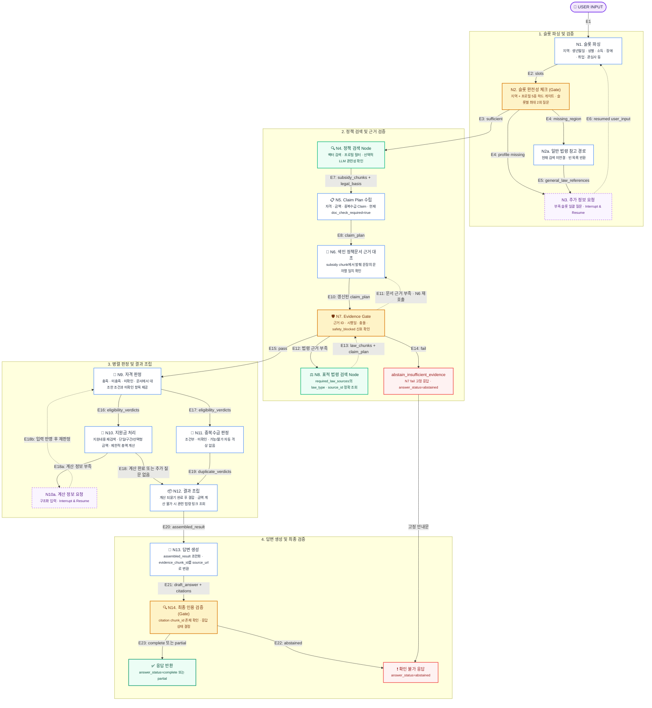

<div align="center">

# 🏛️ 복지 에이전트 (Bokji Agent)

> **"추측하지 않고 오직 검증된 근거로만 답한다"**  
> 공공서비스 및 국가법령정보 기반의 **초신뢰성 멀티노드 RAG 복지 챗봇**

<br/>

[](https://www.python.org/)
[](https://react.dev/)
[](backend/README.md)
[](https://github.com/langchain-ai/langgraph)

[](#)
[](https://aws.amazon.com/)
[](#)
[](https://www.trychroma.com/)
[](tests/)

<br/>

**복지 에이전트(Bokji Agent)**는 사용자의 거주지·연령·가구/소득 상황을 대화형으로 수집하여,  
수혜 가능한 정부 지원 제도를 검색하고 **자격 요건 · 지원 금액 · 중복수급 가능 여부**를 공문서 및 법령 근거와 함께 제공하는 에이전트 서비스입니다.

</div>

**React 프론트엔드는 S3에, FastAPI 백엔드는 AWS EC2에 배포되어 있습니다.** 회원 정보는 원격 MySQL에 저장하며, LLM은 RunPod를 우선 사용하고 HuggingFace로 폴백합니다. 회원가입·로그인·마이페이지, 자동 추천, 일반 상담·되묻기, 정책 상세·비교·문의 기능을 제공합니다. Streamlit은 레거시 데모로 남아 있습니다.

개발 기준은 [프로젝트 준수 기준](docs/PROJECT_COMPLIANCE.md#서비스-전환-기준), API별 결정 사항은 [백엔드 계약 추적표](backend/README.md#원본-문서와-남은-계약-차이), 자동 추천과 계산 입력은 [API-14와 공용 계산 입력 명세](docs/AUTO_RECOMMENDATION_API.md)를 참고하세요.

---

### 👥 팀원 소개 (Team Members)

### 4차 프로젝트


| 팀원 |       역할        |       담당 업무        |
| :---: |:----------------------------------------------------------:|:----------------------------------------------------------------------------------------------------------------------------------------------------------------------------------------------------------------------------------------------------------------------------------------------------------------------------------------------------------------------------------------------------------|
| **이수연**<br><br> [](https://github.com/lesoo) |          **팀장, PM**           | • 중복 검색 내용 확인<br>• 지원금 계산기 재확인<br>• 자격검증 재확인<br>• 구비서류 데이터 VectorDB 요소 추가<br>• 평가지표·방법 다양화 평가<br>• React+FastAPI Migration 계획, API 문서, 화면 기획서 작성<br>• Frontend/Backend 병합 |
| **김일환**<br><br> [](https://github.com/KangDohwa) | **[Role Placeholder]**  | • 검색 기능 고도화(사용자 적합성, 소요시간 단축)<br>• LLM 모델별 답변 분석 및 선정<br>• Backend Migration<br>• AWS EC2/S3 배포 |
| **허유나**<br><br> [](https://github.com/Heoyuna0819) |   **[Role Placeholder]**   | • Streamlit 화면 디자인 고도화<br>• 구비서류 안내<br>• LLM Output 정형화<br>• LLM 모델별 답변 분석 및 선정<br>• Frontend Migration<br>• Production QA/QC |
| **김길환**<br><br> [](https://github.com/amygdalis24) |   **[Role Placeholder]**    | • 단순 질의 대화형 챗봇 기능 추가<br>• Frontend Migration<br>• Production QA/QC |
| **주상현**<br><br> [](https://github.com/shju0924-ai) |   **[Role Placeholder]**     | • 회원정보 기반 정책 조회 기능 추가(Node4 활용)<br>• Backend Migration<br>• Production QA/QC |


<details>
<summary>3차 프로젝트 역할 보기</summary>

### 3차 프로젝트

| 팀원 |                             역할                             | 담당 노드 및 핵심 파이프라인                                                                                                                                                                                                                                                                                                                                                                                          |
| :---: |:----------------------------------------------------------:|:----------------------------------------------------------------------------------------------------------------------------------------------------------------------------------------------------------------------------------------------------------------------------------------------------------------------------------------------------------------------------------------------------------|
| **이수연**<br><br> [](https://github.com/lesoo) |          **팀장, PM** <br>Graph Builder & Reasoning          | • **그래프 오케스트레이션**: LangGraph 전체 노드 배선(StateGraph) 및 파이프라인 최적화<br>• **추론·판정·검증 노드 전담 (N9 ~ N14)**<br>  - N9 자격 판정 / N10 지원금 계산 / N11 중복수급 판정<br>  - N12 결과 조립 / N13 답변 생성 / N14 최종 인용 검증<br>• **벡터 인덱싱**: Document 청킹 및 ChromaDB 벡터 적재 파이프라인 구축<br>• **평가 파이프라인**: 100문항 벤치마크 및 다중 턴 되묻기 자동 평가 러너 구축<br>• **프로젝트 총괄/통합**: 일정·품질 관리, LangGraph 노드 배선, Streamlit 연동, 코드 리뷰 및 브랜치 통합                          |
| **김일환**<br><br> [](https://github.com/KangDohwa) | **TL(Tech Lead)** <br>Evidence Gate & Service Architecture | • **근거 검증 및 법령 검색 노드 (N7, N8)**<br>  - N7 Evidence Gate (슈퍼바이저 4-way 검증) / N8 표적 법령 정밀 검색<br>• **RAG 아키텍처 및 데이터 계약**: 계층형 지역명 표준화 및 법령 메타데이터 계약 수립<br>• **서비스 연동 & 세션 관리**: LangGraph 파이프라인과 Streamlit UI 간 E2E 어댑터 구현<br>• **코드 품질 관리**: 기술 의사결정 자문, 개발·코드 품질 기준 수립, 코드 리뷰 및 브랜치 통합                                                                                                                      |
| **허유나**<br><br> [](https://github.com/Heoyuna0819) |               **Law Data & Retrieval Nodes**               | • **정책 검색 및 원문 대조 노드 (N4 ~ N6)**<br>  - N4 정책 검색 Agent / N5 Claim Plan 분해 / N6 공식 공고·지침 대조<br>• **법령 데이터 파이프라인**: 국가법령정보센터 19만 건(법령·규칙·조례) 대규모 수집 및 정제<br>• **모델 평가 실험**: 구조화 출력(Structured Output) 및 LLM-as-judge 원문 대조 실험                                                                                                                                                                               |
| **김길환**<br><br> [](https://github.com/amygdalis24) |                **Subsidy Data Engineering**                | • **공공서비스 데이터 파이프라인**: 공공데이터포털 공공서비스 API 3종(목록·상세·조건) 전수 수집<br>• **데이터 정규화**: 10,968건 복지 정책 데이터 병합, 결측치 정제 및 Document 스키마 변환<br>• **데이터 품질 관리**: 수집 데이터 인수 검증(Handoff Validation) 및 매니페스트 명세화                                                                                                                                                                                                             |
| **주상현**<br><br> [](https://github.com/shju0924-ai) |            **Slot Parsing, Frontend UI & Auth**            | • **슬롯 파싱 및 대화 제어 노드 (N1 ~ N3)**<br>  - N1 슬롯 파싱 / N2 적합성 체크(지역 하드 게이트) / N2a 일반 법령 참고 / N3 재질문(되묻기)<br>• **프론트엔드 UI**: Streamlit 기반 대화형 웹 챗봇, 요약 진단 카드 및 정책 캐러셀 구현<br>• **사용자 인증 & 보안**: SQLite 회원 관리 및 Fernet 대칭키 기반 개인정보(PII) 암호화 저장소 구축<br>• **RAG 기초 설계**: 1차 Document/Chunk 스키마 정의 및 초기 ChromaDB 벡터스토어 구축                                                                                           |

</details>


---

## 📌 목차 (Table of Contents)

- [✨ 핵심 가치 및 차별점](#-핵심-가치-및-차별점-core-values)
- [🏗️ 시스템 아키텍처](#system-architecture)
- [🧩 에이전트 파이프라인 (LangGraph N1-N14 Pipeline)](#-에이전트-파이프라인-langgraph-n1-n14-pipeline)
- [🛠 기술 스택](#-기술-스택-tech-stack)
- [📊 데이터셋 및 벡터 색인 사양](#-데이터셋-및-벡터-색인-사양-dataset--index)
- [📂 프로젝트 구조](#-프로젝트-구조-project-structure)
- [🚀 시작하기 (Quick Start)](#-시작하기-quick-start)
  - [사전 요구사항](#사전-요구사항)
  - [설치 및 설정](#설치-및-설정)
  - [환경 변수 (.env)](#환경-변수-설정-env)
  - [데이터 준비](#데이터-준비)
  - [실행](#서비스-실행)
- [🧪 테스트 및 벤치마크](#-테스트-및-벤치마크-testing--evaluation)
- [⚠️ 알려진 한계](#️-알려진-한계-known-limitations)
- [📄 관련 문서](#-관련-문서-documentation)

---

## ✨ 핵심 가치 및 차별점 (Core Values)

```
[ 단 하나의 대원칙 ]
"검색된 공적 근거로 명확히 입증된 내용만 답한다."
근거가 부족하면 어설프게 추측하지 않고 "미확인"으로 분류하며 공식 접수처 안내로 보류합니다.
```

1. **환각 억제를 위한 다단계 검증**
   - 정책 문서에서 주장(Claim)을 추출하고, 색인된 정책 청크와의 문자열 대조(N6)와 근거 검증(N7)을 거쳐 답변을 생성합니다.
2. **동적 슬롯 파싱 & 하드 게이팅 (Interrupt & Resume)**
   - 일반 상담은 지역 등 필수 조건이 누락되면 추가 질문을 합니다. 자동 추천(API-14)은 질문 없이 저장 프로필만 사용하며 지역이 없으면 확인된 전국 대상만 검색합니다.
3. **자격 · 지원금 · 중복수급 삼각 판정**
   - 사용자 정보를 바탕으로 **자격 충족/미충족/미확인**, **계산 가능한 지원금액**, **타 복지와의 중복수급 제한**을 함께 제공합니다.
4. **규칙 기반 안전 폴백(Graceful Fallback)**
   - RunPod Pod 호출에 실패하면 설정된 HF 토큰으로 남은 실행 시간 안에서 HuggingFace를 호출합니다. 일반 상담에서는 LLM 오류 시 규칙·템플릿 응답을 사용하며, 실행 시간을 초과하거나 자동 추천의 최종 LLM 호출이 실패하면 오류를 반환합니다. [한도와 실행 스레드의 제약](docs/RUNPOD_SETUP_DRAFT.md#노드-총-실행-한도)을 참고하세요.

---

<a name="system-architecture"></a>
## 🏗️ 시스템 아키텍처

배포 구조는 **S3의 React → EC2의 FastAPI → ChromaDB / RunPod + HuggingFace 폴백**이며, 운영 회원 정보는 **원격 MySQL**에 저장합니다.

상담 요청은 `React → FastAPI → service.ask() / answer_followup() → LangGraph → ChromaDB / LLM` 순서로 처리하며, 브라우저 인증에는 HttpOnly 세션 쿠키를 사용합니다. 홈은 API-14로 저장 프로필 기반 추천을 받아 앱 메모리에 캐시합니다. 일반 상담은 API-10으로 시작하고, API-11로 추가 질문·계산 입력과 새 턴을 처리합니다. 진행률은 별도 GET API로 조회합니다.

정책 목록·상세·비교는 같은 `policies` 응답을 재사용합니다. 정책 문의(API-12)는 전체 그래프를 다시 실행하지 않고, `light_followup`에서 세션에 저장된 마지막 정책·프로필을 이용해 답합니다.

아래 이미지는 Streamlit 데모의 구조입니다. FastAPI 구성은 [백엔드 구조](backend/README.md#구성과-api-범위)를 참고하세요. 데이터 수집·색인은 상담 요청과 별도로 실행합니다.



> N1~N14 제어 흐름은 아래 [에이전트 파이프라인](#-에이전트-파이프라인-langgraph-n1-n14-pipeline)을 참고하세요.

---

## 🧩 에이전트 파이프라인 (LangGraph N1-N14 Pipeline)

복지 에이전트는 **N1~N14와 보조 노드 N2a·N10a, 근거 부족 보류 노드**를 LangGraph로 연결합니다.

> 아래는 일반 상담의 흐름입니다. API-14는 초기·계산 질문을 생략하고 최종 카드에 자동 추천 필터를 적용합니다. 상담이 끝난 뒤에도 같은 세션에서 새 질문을 이어갈 수 있습니다. 계산에 필요한 추가 정보는 [상담·계산 입력 명세](backend/README.md#상담-턴과-계산-입력)에 맞춰 전달합니다.



<details>
<summary><b>🔍 각 노드별 세부 역할 및 구현 파일 보기</b></summary>

모듈 경로는 `src/rag_chatbot/graph/nodes/` 기준입니다.

| 노드 | 구현 모듈 | 핵심 역할                                                |
|:---:|:---|:-----------------------------------------------------|
| **N1** | `slot_parser.py` | 규칙과 선택적 LLM으로 슬롯 추출, 저장 프로필과의 충돌 확인 |
| **N2** | `slot_completeness_gate.py` | 서비스 진행을 위한 필수 조건(거주 지역 등) 충족 여부 판정                   |
| **N2a**| `general_law_reference_search.py` | 지역 정보 부족 시 참고 검색 경로 호출. `../retrieval_gateway.py`는 미연결 상태로 빈 목록 반환 |
| **N3** | `request_missing_slots.py` | 사용자에게 빠진 슬롯을 되묻고 그래프 실행 일시 정지 (`interrupt`)          |
| **N4** | `policy_search.py` | 슬롯·프로필 조건으로 후보 지원제도를 넓게 벡터 검색한 뒤, LLM이 있으면 관련성 게이트로 무관 후보를 걷어내고 상위 Top-K만 채택 |
| **N5** | `claim_plan.py` | LLM 또는 규칙으로 후보 정책 청크의 자격·지원금·중복수급 주장(Claim) 추출 |
| **N6** | `document_verification.py` | 발췌 문장이 색인된 정책 청크에 포함되는지 문자열 대조 |
| **N7** | `evidence_gate.py` | 근거의 충분성·시행일자 유효성·법령 충돌 여부 검사 |
| **N8** | `targeted_law_search.py` | `required_law_sources`의 `law_type`·`source_id`로 법령 메타데이터 조회 |
| **N9** | `eligibility_verdict.py` | 규칙으로 조건 대조·자격 판정 (`충족` / `미충족` / `미확인`), 선택적 LLM으로 사유 문장 정리 |
| **N10**| `benefit_calculator.py` | 자격 충족 정책의 금액·구간·선택형 규칙 추출 및 입력값에 따른 제한적 계산 |
| **N10a**| `request_calc_info.py` | 계산에 필요한 슬롯·선택지를 되묻고 N9로 재개. 자동 추천에서는 질문 생략 |
| **N11**| `duplicate_benefit.py` | 타 정부지원 사업과의 중복수급 허용 여부 판정                            |
| **N12**| `result_assembly.py` | 정책별 판정 및 근거 데이터 정합성 조립 (근거 없는 합산 방지)                 |
| **N13**| `answer_generation.py` | 규칙 템플릿과 선택적 LLM 요약으로 설명문·인용 조립 |
| **N14**| `final_verification.py` | 인용 `chunk_id` 존재 여부 확인 및 최종 응답 상태 결정                 |

</details>

---

## 🛠 기술 스택 (Tech Stack)

| 계층 | 기술 / 도구 | 선정 및 사용 이유 |
| :--- | :--- | :--- |
| **Orchestration** | `LangGraph 1.2.11` (LangChain Core 기반) | 조건부 라우팅·되묻기 및 메모리 체크포인트 (`MemorySaver`) |
| **LLM & Inference** | 운영: RunPod + HuggingFace 폴백 | Pod 우선 사용. RunPod Serverless·로컬 Ollama도 선택 가능 |
| **Embedding & Vector DB** | `ChromaDB`, `intfloat/multilingual-e5-base` | 768차원 다국어 고밀도 벡터 임베딩 및 메타데이터 필터링 |
| **Frontend UI** | React 18, TypeScript, Vite 5, React Router 6, TanStack Query 5, Axios | S3에 배포된 프론트엔드. 로컬은 Vite, 레거시 데모는 `Streamlit 1.62.0` |
| **HTTP API** | FastAPI, Pydantic, Uvicorn | 회원·옵션·상담·자동 추천 API-01~14, 서버 세션 및 소유권 검증 |
| **Data & Scraping** | `Python 3.11`, `Requests`, 표준 `json` | 공공서비스 및 국가법령정보센터 목록 수집·정규화 |
| **Security & Storage** | 운영: 원격 MySQL, PyMySQL, `bcrypt`, `cryptography (Fernet)` | 민감 프로필 암호화. 로컬 기본은 SQLite이며 MariaDB도 지원. PyMySQL은 백엔드 설치에 포함 |
| **Deployment** | AWS EC2(백엔드) + S3(프론트엔드) | API 서버와 프론트엔드 정적 파일을 분리해 운영 |
| **Quality & Testing** | `pytest`, `unittest`, FastAPI TestClient, Streamlit AppTest, Playwright | 코어·HTTP·레거시 UI 테스트 및 브라우저 회귀 검사 |

---

## 📊 데이터셋 및 벡터 색인 사양 (Dataset & Index)

공공서비스 문서와 법령 목록 메타데이터를 별도 인덱스로 관리합니다. 전체 원천·처리 문서와 벡터 DB는 수집·색인 시 생성하며 Git에 포함하지 않습니다. 저장소에는 [공공서비스 manifest](data/processed/subsidy_manifest.json), [법령 manifest](data/processed/law_manifest.json)와 `data/samples/`의 공개 샘플이 있습니다. 문서·청크 수와 용량은 데이터 스냅샷에 따라 달라집니다.

### 1. 원천 데이터 (`data/processed/`)
- **공공서비스 지원제도 문서 (`subsidy_documents.jsonl`)**: 목록·상세·지원조건을 병합해 변환한 Document JSONL
- **국가법령정보센터 법령 메타데이터 (`law_documents.jsonl`)**: 법령·행정규칙·자치법규 목록을 정규화한 Document JSONL (본문·조문 제외)

### 2. 벡터 색인 사양 (`data/vector_db/`)
| 설정 (`EMBEDDING_PROVIDER`) | 기본 차원 | 특징 및 용도 |
| :--- | :---: | :--- |
| **`korean`** *(서비스 기본값)* | **768** | `intfloat/multilingual-e5-base` 기반 의미 검색 |
| **`hash`** | 128 | `local-hash-v1:128` 제공자. 테스트·오프라인 스모크 전용 |

서비스의 컬렉션 접두사는 `bokji_rag`입니다. 색인과 검색의 제공자·모델·차원이 일치해야 합니다. 기본 재색인 스크립트는 E5 768차원, 청크 최대 800자·겹침 100자를 사용합니다.

> ⚠️ **법령 데이터 범위 준수:** 법령 데이터는 국가법령정보센터의 목록조회 메타데이터(`metadata_only`)만 포함합니다. 관련 법령과 공식 원문 링크를 안내하며, 조문 해석이나 법적 자격 판정의 근거로 사용하지 않습니다.

---

## 📂 프로젝트 구조 (Project Structure)

```plaintext
bokji-agent/
├── backend/                       # FastAPI 앱, 스키마, 세션 저장소, HTTP 테스트
├── frontend/                      # React·TypeScript 화면, API 클라이언트, Vite 및 브라우저 검사
├── app.py                         # 레거시 Streamlit 데모 진입점
├── streamlit_ui/                  # 레거시 화면 계층(API-09가 constants.py 재사용)
│   ├── pages/                     # chat / auth / mypage 뷰
│   ├── pipeline.py                # 공식 서비스 계층 API 어댑터
│   ├── rendering.py               # 위젯(요약 카드, 정책 캐러셀, 근거 뷰어) 렌더러
│   └── session.py                 # 세션 및 사용자 상태 관리
├── src/rag_chatbot/               # 핵심 백엔드 패키지
│   ├── service.py                 # ask() / answer_followup() 메인 인터페이스
│   ├── light_followup.py          # 정책 상세 문의(API-12), 전체 그래프 재실행 없음
│   ├── graph/                     # LangGraph 파이프라인 엔진
│   │   ├── builder.py             # N1~N14 노드 배선 및 그래프 빌더
│   │   ├── nodes/                 # 개별 기능 노드 모듈 (N1 ~ N14)
│   │   ├── slot_schema.py         # 슬롯 정의 및 게이트 규칙
│   │   └── llm_gateway.py         # LLM 호출 제어 및 보정 게이트웨이
│   ├── auth/                      # 회원 관리 및 PII 암호화 (Fernet/bcrypt)
│   ├── collectors/                # 공공서비스 / 법령정보센터 수집 스크립트
│   ├── llm/                       # HF·RunPod·Ollama 클라이언트
│   ├── progress.py                # 상담 진행률 기록
│   └── timing.py                  # 노드별 레이턴시 계측 프로파일러
├── rag_design/                    # 데이터 청크/벡터스토어 스키마 공용 계약
├── scripts/                       # 진단, 재색인 및 벤치마크 유틸리티
├── tests/                         # 코어·인증·LLM·레거시 UI 검증
├── data/                          # 공개 샘플·manifest·평가 질문, 미추적 런타임 데이터
└── docs/                          # 시스템 설계서 및 준수 기준(Gate 0~6)
```

`frontend/src/pages/`에는 로그인·회원가입·홈·상담·마이페이지가 있고, `features/`는 인증·상담 상태와 캐시, `api/`는 HTTP 호출을 담당합니다. 정책 상세·비교·문의는 별도 URL 없이 화면 상태와 다이얼로그로 전환합니다.

---

## 🚀 시작하기 (Quick Start)

### 사전 요구사항
- **Python**: `3.11.x` 권장
- **Node.js / npm**: 프론트엔드 설치·실행에 Node.js `18.x` 또는 `20 이상`과 npm 필요
- **검색 데이터**: 전체 Document JSONL, 지원조건 파일 및 일치하는 ChromaDB 색인. E5 모델 캐시가 없으면 최초 로딩 시 다운로드 필요
- **Streamlit**: 레거시 데모 실행 시에만 `requirements-streamlit.txt`의 `1.62.0` 사용

### 설치 및 설정

**로컬 개발 환경**을 준비하는 절차입니다. 명령은 별도 표시가 없으면 저장소 루트에서 실행합니다. 예시는 PowerShell 기준이며, Bash에서는 가상환경을 `source .venv/bin/activate`로 활성화하고 `Copy-Item` 대신 `cp`를 사용합니다. 기존 환경 파일은 덮어쓰지 말고 필요한 항목만 반영하세요.

```powershell
# 1. 저장소 복제
git clone https://github.com/SKN33-3rd-3Team/bokji-agent.git
cd bokji-agent

# 2. 가상환경 및 백엔드 의존성 설치
python -m venv .venv
.\.venv\Scripts\Activate.ps1
python -m pip install -r backend/requirements-backend.txt

# 3. 최초 설정 시 환경 변수 템플릿 복사
Copy-Item .env.example .env
Copy-Item frontend/.env.example frontend/.env

# 4. 프론트엔드 의존성 설치
cd frontend
npm ci
cd ..
```

### 환경 변수 설정 (`.env`)

백엔드는 루트 `.env`, Vite는 `frontend/.env`를 읽습니다. `.env.example`을 참고해 사용할 환경에 맞게 설정하세요. 셸에 설정된 값이 루트 `.env`보다 우선합니다. 각 변수는 한 번만 정의하고, 변경 후 개발 서버를 재시작하세요. 프론트엔드 배포본에는 다시 빌드해야 반영됩니다. 환경 파일과 비밀값은 커밋하지 않습니다.

| 변수명 | 설정 조건 / 기본값 | 설명 |
| :--- | :--- | :--- |
| `EMBEDDING_PROVIDER` | 선택 / `korean` | `hash`는 오프라인 스모크용. 색인과 검색 설정을 맞춤 |
| `EMBEDDING_MODEL_NAME`, `EMBEDDING_DIMENSION` | Korean 기본 `intfloat/multilingual-e5-base`, `768` | Hash 기본 차원은 `128`. 제공자를 바꿀 때 차원도 함께 설정 |
| `RUNPOD_POD_ID`, `RUNPOD_POD_PORT`, `RUNPOD_POD_API_KEY` | Pod 사용 시 / 포트 `8000` | Pod ID가 있으면 `LLM_BACKEND`보다 우선. API 키는 서빙 설정에 맞춤 |
| `HF_TOKEN` | HF 호출·Pod 폴백 시 필요 | 하위 호환 이름 `HUGGINGFACE_TOKEN`도 지원 |
| `LLM_BACKEND` | Pod 미설정 시 / `hf` | `hf`·`huggingface`, `runpod`(Serverless), `ollama` 중 선택 |
| `RUNPOD_ENDPOINT_ID`, `RUNPOD_API_KEY`, `RUNPOD_MODEL_NAME` | Serverless 선택 시 | Pod가 없고 `LLM_BACKEND=runpod`일 때 사용 |
| `LLM_MODEL_NAME`, `LLM_HF_MODEL` | HF 모델은 앞 변수 우선 | HF 기본 모델은 `Bllossom/llama-3.2-Korean-Bllossom-3B`, 템플릿 예시는 `Qwen/Qwen3.5-9B` |
| `LLM_PROVIDER` | HF 선택 / 미설정 시 자동 라우팅 | 템플릿은 `featherless-ai`. 사용 가능한 제공자·모델 조합에 맞춤 |
| `LLM_MAX_NEW_TOKENS`, `LLM_DISABLE_THINKING` | HF 기본 `8192`, 사고 끄기는 `1`일 때 요청 | 템플릿은 각각 `1024`, `1`. 사고 끄기 지원 여부는 제공자에 따라 다름 |
| `LLM_TIMEOUT_SECONDS`, `LLM_PREFETCH_WORKERS` | 각각 `120`, `4` | Pod·Serverless·Ollama 호출 한도(초)와 N5 병렬 추출 수. 템플릿의 병렬 추출 수는 `5`. N1/N4/N5/N9/N10/N10a/N13은 LLM 사용 시 노드별 총 90초 제한 |
| `OLLAMA_BASE_URL`, `OLLAMA_NUM_CTX` | 로컬 Ollama 선택 / `http://localhost:11434`, `4096` | `LLM_MODEL_NAME` 필수, loopback 주소만 허용. 자동 폴백 대상이 아님 |
| `AUTH_DB_URL` | 운영 원격 MySQL 연결에 필요 | 형식 `mysql://<user>:<password>@<host>:<port>/<dbname>`. 미설정 시 로컬 SQLite이며 DB 장애 시 자동 전환·동기화 없음 |
| `AUTH_DB_PATH` | 로컬 SQLite / `.runtime/auth.db` | `AUTH_DB_URL`이 없을 때만 사용 |
| `AUTH_ENC_KEY` | 운영·공유 DB에 필요 | 회원 PII 암호화 키. 미설정 시 로컬 개발 키 `.runtime/auth_dev.key` 자동 생성 |
| `AUTH_DB_CONNECT_TIMEOUT`, `AUTH_DB_SSL_MODE` | 원격 DB / `10`초, SSL 모드 미지정 | SSL 모드는 빈 값 또는 `REQUIRED`. `REQUIRED`는 TLS 암호화만 강제하고 인증서·호스트 이름은 검증하지 않음 |
| `AUTH_MAX_LOGIN_ATTEMPTS`, `AUTH_LOCKOUT_MINUTES` | 선택 / `5`, `15` | 연속 로그인 실패 잠금 기준 |
| `CORS_ORIGINS`, `COOKIE_SECURE`, `AUTH_SESSION_TTL_DAYS` | 로컬 기본 `http://localhost:5173`, `false`, `7` | 프론트 origin, 쿠키의 Secure 속성, 로그인 세션 유효기간(일). 운영 주소·쿠키 전송 조건에 맞추고 HTTPS에서는 `COOKIE_SECURE=true` 사용 |
| `GOV24_SERVICE_KEY`, `LAW_OC`, `SIGUNGU_CODE_CSV` | 직접 수집 시 | 각각 공공서비스 API 키, 법령 API 사용자 식별자, 선택적 법정동코드 CSV 경로. CSV 미지정 시 시도 코드까지만 채움 |
| `BOKJI_TRACE` | 선택 / 미설정 시 비활성 | `1`로 설정 시 노드 실행·시간 진단 출력 |
| `VITE_API_BASE_URL` | **`frontend/.env`** / 미설정 시 `http://localhost:8000` | API 접두사 `/api/v1`을 붙이지 않은 백엔드 주소. 빈 문자열은 기본 주소로 대체되지 않음. 운영 프론트 빌드에는 실제 백엔드 주소를 사용하며 비밀값을 넣지 않음 |

`python src/rag_chatbot/auth/__main__.py keygen`으로 `AUTH_ENC_KEY`를 생성합니다. 키는 DB와 분리해 보관하고, 기존 공유 DB에는 동일한 키를 사용하세요. 원격 DB의 데이터베이스·접속 계정을 준비한 뒤 [회원 DB 설정](docs/AUTH_REMOTE_DB.md)을 따릅니다.

로컬에서 Pod→HF 폴백을 사용하려면 Pod 설정과 HF 토큰을 함께 설정합니다. Pod가 미설정이고 선택한 HF·Serverless의 자격 증명이 없으면 규칙·템플릿으로 응답합니다. 이때도 검색 데이터는 필요하며 정책 문의는 안내로 제한될 수 있습니다. 지원하지 않는 backend 값이나 Ollama 모델 누락은 설정 오류로 처리합니다.

### 데이터 준비

준비된 데이터를 사용할 때는 `data/processed/subsidy_documents.jsonl`, `data/processed/law_documents.jsonl`, `data/raw/gov24_support_conditions.json`을 배치합니다. 이미 구축된 색인을 받았다면 `data/vector_db/` 전체를 함께 배치하고 제공자·모델·차원을 맞춥니다. 샘플 파일만으로 전체 서비스 색인이 준비되지는 않습니다.

직접 수집하는 경우 아래 명령이 외부 API를 호출하고 원천·처리 문서, manifest·샘플을 갱신합니다. API 자격 증명을 먼저 설정하세요.

```powershell
python -m pip install -r requirements-collection.txt
python -m src.rag_chatbot.collectors.gov_24
python -m src.rag_chatbot.collectors.law

# 전체 Document JSONL을 준비한 뒤 실행. 기존 색인이 있으면 재색인 여부를 먼저 결정
New-Item -ItemType Directory -Force data/vector_db | Out-Null
python scripts/reindex_korean.py
```

재색인 전에 `data/vector_db/` 디렉터리를 만들어야 합니다. Bash에서는 `mkdir -p data/vector_db`를 사용합니다. E5 768차원으로 두 소스를 색인하며 기본 장치는 CPU입니다. GPU 환경은 `--device cuda`로 선택합니다. 같은 제공자의 기존 색인은 갱신됩니다.

서비스 실행에는 `data/vector_db/chroma.sqlite3`가 필요합니다. 데이터 수집·색인은 미리 완료해야 합니다. 지원조건 파일이나 처리된 공공서비스 문서가 없거나 잘못되면 해당 조건·사용자구분 필터를 생략합니다.

### 서비스 실행

```powershell
# 터미널 1: 가상환경을 활성화한 저장소 루트에서 로컬 FastAPI 실행
python -m uvicorn backend.app.main:app --reload --port 8000

# 터미널 2: 저장소 루트에서 로컬 React 실행
cd frontend
npm run dev
```

로컬 화면은 `http://localhost:5173`, API 문서는 `http://localhost:8000/docs`입니다. Axios 클라이언트는 `withCredentials: true`로 세션 쿠키를 전송합니다. 주소·포트를 바꾸면 `VITE_API_BASE_URL`과 `CORS_ORIGINS`를 함께 맞추세요.

백엔드는 시작 시 검색 엔진을 미리 로드하며 `GET /api/v1/config/status`로 준비 상태를 조회할 수 있습니다. `/healthz`의 `ok`는 웹 서버 응답만 확인하며 DB·검색·LLM 연결 상태까지 검사하지 않습니다. 세션을 메모리에 저장하므로 백엔드는 단일 프로세스로 실행합니다.

프론트엔드 배포 파일은 `frontend/`에서 `npm run build`를 실행하면 `dist/`에 생성됩니다. `--reload`와 Vite 개발 서버는 로컬 개발용입니다.

레거시 데모가 필요한 경우:

```bash
python -m pip install -r requirements-streamlit.txt
python -m streamlit run app.py
```

API-09는 `streamlit_ui/constants.py`의 순수 상수를 재사용합니다. 이 파일은 FastAPI에서도 필요하지만 Streamlit 패키지를 설치할 필요는 없습니다.

<details>
<summary><b>🛠️ 유용한 CLI 진단 도구들</b></summary>

```bash
# 1. 터미널 대화형 챗봇 실행
python scripts/interactive_console_chat.py

# 2. 서비스 응답·정책 카드·LLM 상태 수동 진단
python scripts/manual_test_service.py

# 3. HuggingFace 토큰·모델 호출 진단 (RunPod 연결 검사가 아님)
python scripts/check_llm_connection.py

# 4. 한국어 벡터 인덱스 재생성 (GPU 가속 지원)
python scripts/reindex_korean.py --device cuda
```

</details>

---

## 🧪 테스트 및 벤치마크 (Testing & Evaluation)

아래 명령으로 코어·백엔드·레거시 UI 테스트와 프론트엔드 빌드를 실행합니다.

```bash
# 테스트 의존성 (레거시 UI 검사 포함)
python -m pip install -r backend/requirements-test.txt -r requirements-streamlit.txt -r requirements-collection.txt

# 전체 코어·백엔드 테스트 실행
python -m pytest tests/ backend/tests/ -q

# 핵심 영역별 개별 테스트
python -m pytest backend/tests/ -q                   # FastAPI HTTP 계약
python -m pytest -q tests/test_graph_nodes.py          # 자격 판정 로직
python -m pytest -q tests/test_service.py              # ask() 서비스 계약
python -m pytest -q tests/test_streamlit_rendering.py  # Streamlit 위젯 렌더링

# 프론트엔드 TypeScript 검사 + 정적 빌드
cd frontend
npm run build
cd ..

# 검색 데이터·선택한 LLM을 준비한 뒤 고정 Dev 질문 평가 (보고서 생성)
python scripts/run_dev_validation.py
```

`pytest.ini`의 기본 수집 대상은 `tests/`이므로 인자 없는 `python -m pytest -q`에는 `backend/tests/`가 포함되지 않습니다. 프론트 브라우저 회귀 검사는 [별도 절차](frontend/tests/README.md)에 따라 Vite·Edge·Playwright를 준비하고 `frontend/`에서 `node tests/progress-cache.cjs`, `node tests/chat-results.cjs`로 실행합니다. 이 검사는 API를 가상 응답으로 대체하며 운영 DB·LLM 연동을 검증하지 않습니다.

Dev 평가의 기본 입력은 `data/evaluation/dev_questions.jsonl`, 출력은 `artifacts/evaluation/dev/`입니다. 비교 실행 시 `--output-dir`로 다른 경로를 지정해 Baseline을 보존하세요. Holdout은 최종 설정 확정 뒤 Gate 6에서만 사용하며, 평가 결과에는 실패와 건너뛴 항목도 기록합니다.

---

<a id="️-투명한-한계-및-엔지니어링-고려사항-known-limitations"></a>

## ⚠️ 알려진 한계 (Known Limitations)

데이터 범위와 평가 기준은 [`docs/PROJECT_COMPLIANCE.md`](docs/PROJECT_COMPLIANCE.md)를 따릅니다.

- **응답 대기 시간(Latency)**: 후보 정책별 주장 추출·판정에 여러 검색·LLM 호출이 필요합니다. 90초 제한은 노드마다 적용되므로 전체 상담은 더 오래 걸릴 수 있습니다. 화면에 진행률을 표시하고 홈 추천을 앱 메모리에 캐시합니다.
- **세션 영속성**: 로그인 세션·채팅 소유권·`MemorySaver`는 단일 프로세스 메모리에 저장됩니다. 재시작 시 유실되며 여러 worker 간 공유는 지원하지 않습니다. 로그인 TTL은 기본 7일, 채팅 TTL은 없습니다.
- **대화 문맥**: 완료된 상담의 새 턴은 알려진 프로필을 이어받지만 이전 문답 전체를 LLM 대화 문맥으로 전달하지 않습니다. 정책 문의 이력은 프론트 상태이며 서버에 영속 저장하지 않습니다.

- **근거 검증 범위**: N2a 참고 검색은 미연결 상태로 빈 목록을 반환합니다. N6는 색인 문장의 문자열 포함 여부, N14는 인용 `chunk_id` 존재와 응답 상태를 검사합니다.

  검증 대상은 색인된 데이터이며, 공식 원문의 실시간 조회와 모든 문장의 의미 검증은 수행하지 않습니다. N7의 `safety_blocked` 신호를 계산하는 별도 안전 필터는 그래프에 연결되어 있지 않습니다.

- **판정 범위**: 일반 상담은 보류 상태나 일부 자격 조건이 미확인인 상태에서도 정책 카드를 유지할 수 있습니다. API-14는 자격 판정이 `충족`인 정책만 남기고 전역 보류 시 모든 카드를 제외합니다.

  법령 목록 메타데이터는 관련 법령 안내에 사용하며, 조문·법률 해석의 근거로 사용하지 않습니다.

---

<a id="-프로젝트-문서-및-컴플라이언스-documentation"></a>

## 📄 관련 문서 (Documentation)

| 문서명 | 내용 요약 |
| :--- | :--- |
| 📋 [`docs/PROJECT_COMPLIANCE.md`](docs/PROJECT_COMPLIANCE.md) | 프로젝트 준수 기준, Gate 0~6 단계별 통과 규정 및 법령 데이터 범위 |
| 🔌 [`backend/README.md`](backend/README.md) | API-01~14, 인증·세션·계산 입력·구비서류, 원본 대비 승인 결정·구현·검증·담당 |
| 🖥️ [`frontend/README.md`](frontend/README.md) | React 화면 구성·개발 가이드 |
| [`docs/AUTO_RECOMMENDATION_API.md`](docs/AUTO_RECOMMENDATION_API.md) | API-14 v1.0 및 공용 D5/API-11 필드·예시·React 인계 |
| 🗃️ [`docs/AUTH_REMOTE_DB.md`](docs/AUTH_REMOTE_DB.md) | SQLite/MySQL·MariaDB 선택, 드라이버 설치, DB 장애 동작 |
| ⚙️ [`docs/RUNPOD_SETUP_DRAFT.md`](docs/RUNPOD_SETUP_DRAFT.md) | Pod·HF·Serverless 설정과 연결 점검 |
| 📐 [`docs/RAG_DESIGN_PLAN.md`](docs/RAG_DESIGN_PLAN.md) | RAG 청킹, 검색, 노드 인터페이스 통합 아키텍처 설계서 |
| 🗄️ [`docs/VECTOR_STORE.md`](docs/VECTOR_STORE.md) | ChromaDB 스키마 계약 및 메타데이터 정합성 규격 |
| 🧪 [`docs/EVALUATION_AUTOMATION.md`](docs/EVALUATION_AUTOMATION.md) | 고정 Dev 질문 기반 평가 절차·지표 가이드 |
| 🔒 [`docs/PII_LOGGING.md`](docs/PII_LOGGING.md) | 사용자 민감정보(소득, 주민등록상황 등) 처리 및 로깅 정책 |
| 🤝 [`CONTRIBUTING.md`](CONTRIBUTING.md) | 브랜치 네이밍 컨벤션 (`type/#이슈-설명`) 및 코드 리뷰 규칙 |


## 4차 프로젝트 한줄 회고


| 이름 |   |
|---|-------------|
| **수연** | [TDB] |
| **일환** | [TDB] |
| **유나** | [TDB] |
| **길환** | [TDB] |
| **상현** | [TDB] |


<details>
<summary>3차 프로젝트 회고 보기</summary>

## 3차 프로젝트 한줄 회고

| 이름 | 회고                                                                                                                                                                      |
|---|-------------------------------------------------------------------------------------------------------------------------------------------------------------------------|
| **수연** | 팀장이자 PM을 처음 맡게 되었는데, 프로젝트 난이도를 낮게 예상한 탓에 일정이 밀린것이 가장 아쉬웠지만 동시에 기술적으로도 많은 걸 시도해보고 배울 수 있었다. 진행이 순탄치는 않았지만 목표로 정한 수치는 달성해서 다행이라고 생각하고, 끝까지 함께 해준 팀원분들께 감사하다.              |
| **일환** | 흥미가 있던 주제였기에 생각보다 수월하고 간단할 것 같았던 프로젝트였으나, 진행 과정에서 전혀 만만치 않았음을 느꼈다. 그럼에도 팀장님의 리드와 팀원분들의 도움으로 무사히 프로젝트를 마칠 수 있었다고 생각하여 감사하다.                                              |
| **유나** | 처음엔 그냥 챗봇 하나 만드는 줄 알았는데, 실제로 해보니 검색-검증-계산을 다 따로 쪼개고 검증해야 겨우 믿을 만한 답이 나온다는 걸 알게 된 프로젝트였다. 데이터 하나, 모델 하나를 정하는 데도 실험으로 근거를 만들어야 한다는 걸 몸으로 익히게 되는 경험이었다.                    |
| **길환** | 개인사정으로 인해 프로젝트 개발부분에서 참여도가 낮았던 부분이 가장 아쉽습니다. 그래도 발표자였던 덕분에 이번 프로젝트와 관련된 지식과 설계과정에 대해서 공부할 수 있었으며, 4차 프로젝트 때는 현 프로젝트에 대한 이해도를 높여 개발과정에도 더 기여할 수 있었으면 좋겠습니다.              |
| **상현** | 이번 프로젝트는 간단할거라 생각했는데 생각보다 설계해야할것도 많았고 구현하고, 고려해야할 요소들도 많았었다.<br>그래도 팀원들이랑 으쌰으쌰 하고 많은 도움을 받아서 이번 프로젝트를 잘 마무리 할 수 있었던것 같다.<br>보완 할수 있는 부분 보완하고 4차때는 조금 더 발전 할 수 있도록 해야겠다. |

</details>
