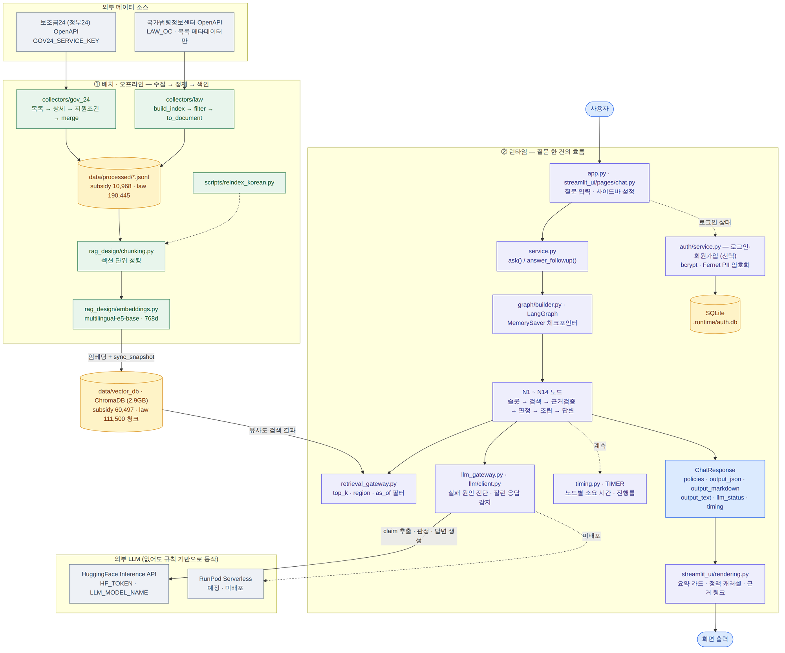
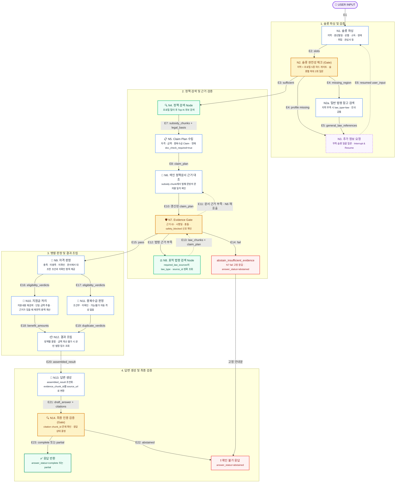

<div align="center">

# 🏛️ 복지 에이전트 (Bokji Agent)

> **"추측하지 않고 오직 검증된 근거로만 답한다"**  
> 공공서비스 및 국가법령정보 기반의 **초신뢰성 멀티노드 RAG 복지 챗봇**

<br/>

[](https://www.python.org/)
[](backend/README.md)
[](https://github.com/langchain-ai/langgraph)
[](https://www.trychroma.com/)
[](tests/)

<br/>

**복지 에이전트(Bokji Agent)**는 사용자의 거주지·연령·가구/소득 상황을 대화형으로 수집하여,  
수혜 가능한 정부 지원 제도를 검색하고 **자격 요건 · 지원 금액 · 중복수급 가능 여부**를 공문서 및 법령 근거와 함께 제공하는 에이전트 서비스입니다.

</div>

최종 서비스 구성은 **React + FastAPI**입니다. 이 브랜치에는 FastAPI 백엔드가 있으며 React 화면은 별도 브랜치에서 개발 중입니다. Streamlit은 향후 제거할 레거시 데모입니다. 기준 자료와 확정 결정은 [프로젝트 준수 기준](docs/PROJECT_COMPLIANCE.md#서비스-전환-기준), 현재 승인 계약·구현·검증·담당은 [백엔드 계약 추적표](backend/README.md#원본-문서와-남은-계약-차이)에 정리합니다. 로그인 후 서버 저장 프로필로 질문 없이 추천하는 [API-14와 공용 계산 입력 명세](docs/AUTO_RECOMMENDATION_API.md)도 제공합니다.

---

### 👥 팀원 소개 (Team Members)

| 팀원 |                             역할                             | 담당 노드 및 핵심 파이프라인                                                                                                                                                                                                                                                                                                                                                                                          |
| :---: |:----------------------------------------------------------:|:----------------------------------------------------------------------------------------------------------------------------------------------------------------------------------------------------------------------------------------------------------------------------------------------------------------------------------------------------------------------------------------------------------|
| **이수연**<br><br> [](https://github.com/lesoo) |          **팀장, PM** <br>Graph Builder & Reasoning          | • **그래프 오케스트레이션**: LangGraph 전체 노드 배선(StateGraph) 및 파이프라인 최적화<br>• **추론·판정·검증 노드 전담 (N9 ~ N14)**<br>  - N9 자격 판정 / N10 지원금 계산 / N11 중복수급 판정<br>  - N12 결과 조립 / N13 답변 생성 / N14 최종 인용 검증<br>• **벡터 인덱싱**: Document 청킹 및 ChromaDB 벡터 적재 파이프라인 구축<br>• **평가 파이프라인**: 100문항 벤치마크 및 다중 턴 되묻기 자동 평가 러너 구축<br>• **프로젝트 총괄/통합**: 일정·품질 관리, LangGraph 노드 배선, Streamlit 연동, 코드 리뷰 및 브랜치 통합                          |
| **김일환**<br><br> [](https://github.com/KangDohwa) | **TL(Tech Lead)** <br>Evidence Gate & Service Architecture | • **근거 검증 및 법령 검색 노드 (N7, N8)**<br>  - N7 Evidence Gate (슈퍼바이저 4-way 검증) / N8 표적 법령 정밀 검색<br>• **RAG 아키텍처 및 데이터 계약**: 계층형 지역명 표준화 및 법령 메타데이터 계약 수립<br>• **서비스 연동 & 세션 관리**: LangGraph 파이프라인과 Streamlit UI 간 E2E 어댑터 구현<br>• **코드 품질 관리**: 기술 의사결정 자문, 개발·코드 품질 기준 수립, 코드 리뷰 및 브랜치 통합                                                                                                                      |
| **허유나**<br><br> [](https://github.com/Heoyuna0819) |               **Law Data & Retrieval Nodes**               | • **정책 검색 및 원문 대조 노드 (N4 ~ N6)**<br>  - N4 정책 검색 Agent / N5 Claim Plan 분해 / N6 공식 공고·지침 대조<br>• **법령 데이터 파이프라인**: 국가법령정보센터 19만 건(법령·규칙·조례) 대규모 수집 및 정제<br>• **모델 평가 실험**: 구조화 출력(Structured Output) 및 LLM-as-judge 원문 대조 실험                                                                                                                                                                               |
| **김길환**<br><br> [](https://github.com/amygdalis24) |                **Subsidy Data Engineering**                | • **공공서비스 데이터 파이프라인**: 공공데이터포털 공공서비스 API 3종(목록·상세·조건) 전수 수집<br>• **데이터 정규화**: 10,968건 복지 정책 데이터 병합, 결측치 정제 및 Document 스키마 변환<br>• **데이터 품질 관리**: 수집 데이터 인수 검증(Handoff Validation) 및 매니페스트 명세화                                                                                                                                                                                                             |
| **주상현**<br><br> [](https://github.com/shju0924-ai) |            **Slot Parsing, Frontend UI & Auth**            | • **슬롯 파싱 및 대화 제어 노드 (N1 ~ N3)**<br>  - N1 슬롯 파싱 / N2 적합성 체크(지역 하드 게이트) / N2a 일반 법령 참고 / N3 재질문(되묻기)<br>• **프론트엔드 UI**: Streamlit 기반 대화형 웹 챗봇, 요약 진단 카드 및 정책 캐러셀 구현<br>• **사용자 인증 & 보안**: SQLite 회원 관리 및 Fernet 대칭키 기반 개인정보(PII) 암호화 저장소 구축<br>• **RAG 기초 설계**: 1차 Document/Chunk 스키마 정의 및 초기 ChromaDB 벡터스토어 구축                                                                                           |

---

## 📌 목차 (Table of Contents)

- [✨ 핵심 가치 및 차별점](#-핵심-가치-및-차별점-core-values)
- [🏗️ 시스템 아키텍처](#system-architecture)
- [🧩 에이전트 파이프라인 (LangGraph N1-N14 Pipeline)](#-에이전트-파이프라인-langgraph-n1-n14-pipeline)
- [🛠 기술 스택](#-기술-스택-tech-stack)
- [📊 데이터셋 및 벡터 색인 사양](#-데이터셋-및-벡터-색인-사양-dataset--index)
- [📂 프로젝트 구조](#-프로젝트-구조-project-structure)
- [🚀 시작하기 (Quick Start)](#-시작하기-quick-start)
  - [사전 요구사항](#사전-요구사항)
  - [설치 및 설정](#설치-및-설정)
  - [환경 변수 (.env)](#환경-변수-설정-env)
  - [실행](#서비스-실행)
- [🧪 테스트 및 벤치마크](#-테스트-및-벤치마크-testing--evaluation)
- [⚠️ 투명한 한계 및 엔지니어링 고려사항](#️-투명한-한계-및-엔지니어링-고려사항-known-limitations)
- [📄 프로젝트 문서 및 컴플라이언스](#-프로젝트-문서-및-컴플라이언스-documentation)

---

## ✨ 핵심 가치 및 차별점 (Core Values)

```
[ 단 하나의 대원칙 ]
"검색된 공적 근거로 명확히 입증된 내용만 답한다."
근거가 부족하면 어설프게 추측하지 않고 "미확인"으로 분류하며 공식 접수처 안내로 보류합니다.
```

1. **환각 억제를 위한 다단계 검증**
   - 정책 문서에서 주장(Claim)을 추출하고 원문과의 교차 대조(N6) 및 Evidence Gate(N7)를 통과해야만 답변 생성에 반영됩니다.
2. **동적 슬롯 파싱 & 하드 게이팅 (Interrupt & Resume)**
   - 일반 상담은 지역 등 필수 조건이 누락되면 추가 질문을 합니다. 자동 추천(API-14)은 질문 없이 저장 프로필만 사용하며 지역이 없으면 확인된 전국 대상만 검색합니다.
3. **자격 · 지원금 · 중복수급 삼각 판정**
   - 단순히 정책을 요약하는 것을 넘어, 사용자의 슬롯 조건을 기반으로 **충족/미충족/미확인**, **계산 가능한 지원금액**, **타 복지와의 중복수급 제한**을 구조화하여 산출합니다.
4. **규칙 기반 안전 폴백(Graceful Fallback)**
   - 설정에 따라 RunPod Pod 실패 시 남은 노드 실행 시간 안에서 HuggingFace로 전환합니다. 일반 상담의 비시간초과 오류에는 기존 규칙·템플릿/안내 경로가 있지만, 노드 총 90초 소진과 자동 추천의 최종 제공자 실패는 오류로 반환합니다. [한도와 실행 스레드의 제약](docs/RUNPOD_SETUP_DRAFT.md#노드-총-실행-한도)을 참고하세요.

---

<a name="system-architecture"></a>
## 🏗️ 시스템 아키텍처

온라인 상담은 `React → FastAPI → 기존 서비스·LangGraph → Vector DB / LLM` 흐름을 목표로 합니다. 회원 정보는 별도의 SQLite 또는 MySQL/MariaDB에 저장합니다. React 통합은 아직 완료되지 않았으며, 기존 그래프·RAG를 재사용하면서 인증 서비스·저장소와 LLM 연동도 수정했습니다.

아래 이미지는 기존 Streamlit 구성의 참고 그림입니다. 현재 API 구성은 [백엔드 구조](backend/README.md#구성과-api-범위)를 따릅니다. 오프라인 수집·색인 경로는 상담 요청 처리와 분리합니다.



> 세부적인 N1~N14 제어 흐름은 아래의
> [에이전트 파이프라인](#-에이전트-파이프라인-langgraph-n1-n14-pipeline)을 참고하세요.

---

## 🧩 에이전트 파이프라인 (LangGraph N1-N14 Pipeline)

복지 에이전트는 사용자의 질문을 단순 생성하지 않고, **14개의 LangGraph 상태 노드**를 통해 팩트체크 및 자격 검증을 거친 후 안전하게 답변합니다.

> 아래는 일반 상담의 기본 흐름입니다. API-14는 초기·계산 질문을 생략하고 최종 카드에 자동 추천 필터를 적용합니다. 완료된 상담은 같은 세션의 새 턴으로 이어갈 수 있으며, 계산 중에는 구조화 입력을 사용합니다. [현재 HTTP 계약](backend/README.md#상담-턴과-계산-입력)을 따릅니다.



<details>
<summary><b>🔍 각 노드별 세부 역할 및 구현 파일 보기</b></summary>

| 노드 | 구현 모듈 | 핵심 역할                                                |
|:---:|:---|:-----------------------------------------------------|
| **N1** | `graph/nodes/slot_parser.py` | LLM을 이용하여 사용자 입력 문장에서 슬롯(나이, 지역, 상황) 추출 (Rule + LLM) |
| **N2** | `slot_completeness_gate.py` | 서비스 진행을 위한 필수 조건(거주 지역 등) 충족 여부 판정                   |
| **N2a**| `general_law_reference_search.py` | 지역 정보 미확인 상태에서 안내할 수 있는 전국 단위 참고 법령 탐색               |
| **N3** | `request_missing_slots.py` | 사용자에게 빠진 슬롯을 되묻고 그래프 실행 일시 정지 (`interrupt`)          |
| **N4** | `policy_search.py` | 사용자 슬롯 조건에 부합하는 후보 지원제도 Top-K 벡터 검색                  |
| **N5** | `claim_plan.py` | LLM을 이용하여 후보 정책 원문에서 자격·지원금·중복수급 주장(Claim) 추출                  |
| **N6** | `document_verification.py` | 추출된 주장이 실제 수집 원문에 존재하는지 팩트체크 대조                      |
| **N7** | `evidence_gate.py` | 근거의 충분성·시행일자 유효성·법령 충돌 여부를 통제하는 슈퍼바이저 게이트            |
| **N8** | `targeted_law_search.py` | 선언된 법령명 기반 정밀 타겟 메타데이터 검색                            |
| **N9** | `eligibility_verdict.py` | LLM을 이용하여 조건 대조를 통한 현재 구현 범위 내 자격 판정 (`충족` / `미충족` / `미확인`)    |
| **N10**| `benefit_calculator.py` | 공식 근거가 확보된 명확한 산식에 한해서만 지원금액 계산                      |
| **N11**| `duplicate_benefit.py` | 타 정부지원 사업과의 중복수급 허용 여부 판정                            |
| **N12**| `result_assembly.py` | 정책별 판정 및 근거 데이터 정합성 조립 (근거 없는 합산 방지)                 |
| **N13**| `answer_generation.py` | 신뢰할 수 있는 최종 사용자 맞춤형 설명문 LLM을 이용하여 생성                           |
| **N14**| `final_verification.py` | 인용 `chunk_id` 존재 여부 확인 및 최종 응답 상태 결정                 |

</details>

---

## 🛠 기술 스택 (Tech Stack)

| 계층 | 기술 / 도구 | 선정 및 사용 이유 |
| :--- | :--- | :--- |
| **Orchestration** | `LangGraph`, `LangChain` | 14개 노드 간 조건부 라우팅 및 Stateful Checkpointing (`MemorySaver`) |
| **LLM & Inference** | HuggingFace API, RunPod Pod / Serverless | Pod 우선, HF 자격 증명이 있으면 호출 실패 시 HF 폴백. 모델은 환경설정으로 지정 |
| **Embedding & Vector DB** | `ChromaDB`, `intfloat/multilingual-e5-base` | 768차원 다국어 고밀도 벡터 임베딩 및 메타데이터 필터링 |
| **Frontend UI** | React (목표), `Streamlit 1.62.0` (레거시) | React는 별도 브랜치에서 개발 중. 기존 데모는 Streamlit으로 실행 |
| **HTTP API** | FastAPI, Pydantic, Uvicorn | 회원·옵션·상담·자동 추천 API-01~14, 서버 세션 및 소유권 검증 |
| **Data & Scraping** | `Python 3.11`, `Requests`, `xmltodict` | 공공데이터포털(공공서비스) 및 국가법령정보센터 대규모 수집 |
| **Security & Storage** | SQLite / MySQL·MariaDB, `bcrypt`, `cryptography (Fernet)` | 회원 저장소 선택, 민감 프로필 암호화. 원격 DB 드라이버는 별도 설치 |
| **Quality & Testing** | `pytest`, `pytest-subtests`, FastAPI TestClient, Streamlit AppTest | 코어·HTTP 계약 및 레거시 UI 검사. 실제 서비스 통합은 별도 검증 |

---

## 📊 데이터셋 및 벡터 색인 사양 (Dataset & Index)

신뢰할 수 있는 공공 출처의 데이터를 가공하여 다중 인덱스를 운용합니다.

### 1. 원천 데이터 (`data/processed/`)
- **공공서비스 지원제도 문서 (`subsidy_documents.jsonl`)**: `10,968건` (43.3 MB)
- **국가법령정보센터 법령 메타데이터 (`law_documents.jsonl`)**: `190,445건` (396.0 MB)

### 2. 벡터 색인 사양 (`data/vector_db/`, 총 2.9 GB)
| 제공자 (Provider) | 차원 | Subsidy 청크 | Law 청크 | 특징 및 용도 |
| :--- | :---: | :---: | :---: | :--- |
| **`korean`** *(운영 표준)* | **768** | **60,497** | **111,500** | `multilingual-e5-base` 기반 실 서비스 의미론적 검색 |
| **`local-hash-v1`** | 128 | 45,413 | 1,465 | 네트워크/GPU가 없는 오프라인 스모크 테스트 전용 |

> ⚠️ **법령 데이터 범위 준수:** 국가법령정보센터 목록조회 메타데이터(`metadata_only`)를 의도적으로 타겟팅하여, 법적 자격을 무단 확정하지 않고 관련 법률 목록 및 공식 웹사이트 이동 링크만을 안전하게 안내합니다.

---

## 📂 프로젝트 구조 (Project Structure)

```plaintext
bokji-agent/
├── backend/                       # FastAPI 앱, 스키마, 세션 저장소, HTTP 테스트
├── app.py                         # 레거시 Streamlit 데모 진입점
├── streamlit_ui/                  # 레거시 화면 계층(API-09가 constants.py 재사용)
│   ├── pages/                     # chat / auth / mypage 뷰
│   ├── pipeline.py                # 공식 서비스 계층 API 어댑터
│   ├── rendering.py               # 위젯(요약 카드, 정책 캐러셀, 근거 뷰어) 렌더러
│   └── session.py                 # 세션 및 사용자 상태 관리
├── src/rag_chatbot/               # 핵심 백엔드 패키지
│   ├── service.py                 # ask() / answer_followup() 메인 인터페이스
│   ├── graph/                     # LangGraph 파이프라인 엔진
│   │   ├── builder.py             # N1~N14 노드 배선 및 그래프 빌더
│   │   ├── nodes/                 # 개별 기능 노드 모듈 (N1 ~ N14)
│   │   ├── slot_schema.py         # 슬롯 정의 및 게이트 규칙
│   │   └── llm_gateway.py         # LLM 호출 제어 및 보정 게이트웨이
│   ├── auth/                      # 회원 관리 및 PII 암호화 (Fernet/bcrypt)
│   ├── collectors/                # 공공서비스 / 법령정보센터 수집 스크립트
│   └── timing.py                  # 노드별 레이턴시 계측 프로파일러
├── rag_design/                    # 데이터 청크/벡터스토어 스키마 공용 계약
├── scripts/                       # 진단, 재색인 및 벤치마크 유틸리티
├── tests/                         # 코어·인증·LLM·레거시 UI 검증
└── docs/                          # 시스템 설계서 및 준수 기준(Gate 0~6)
```

`frontend/`는 별도 React 브랜치의 개발 대상이며 현재 체크아웃에는 포함되지 않습니다. 화면 목록·상세·비교는 같은 상담 응답을 재사용하고, 정책 문의는 별도 다이얼로그로 제공하는 설계입니다.

---

## 🚀 시작하기 (Quick Start)

### 사전 요구사항
- **Python**: `3.11.x` 권장
- **React**: 별도 브랜치 개발·통합 후 해당 실행 절차 확인 필요
- **Streamlit**: 레거시 데모 실행 시에만 `requirements-streamlit.txt`의 `1.62.0` 사용

### 설치 및 설정

```bash
# 1. 저장소 복제
git clone https://github.com/SKN33-3rd-3Team/bokji-agent.git
cd bokji-agent

# 2. 의존성 패키지 설치
python -m pip install -r backend/requirements-backend.txt

# 3. 환경 변수 템플릿 복사
cp .env.example .env
```

### 환경 변수 설정 (`.env`)

주요 설정 항목은 다음과 같습니다. (`.env` 파일은 보안상 절대 커밋하지 마세요.)

| 변수명 | 필수 여부 | 기본값 / 예시 | 설명 |
| :--- | :---: | :--- | :--- |
| `EMBEDDING_PROVIDER` | **필수** | `korean` | 임베딩 엔진 (`korean`: e5-base, `hash`: 오프라인용) |
| `EMBEDDING_MODEL_NAME`| 선택 | `intfloat/multilingual-e5-base` | 사용할 HuggingFace 임베딩 모델명 |
| `HF_TOKEN` | 선택 | `hf_...` | HuggingFace Inference API 액세스 토큰 |
| `LLM_MODEL_NAME` | 선택 | `Qwen/Qwen3.5-9B` | 추론 모델명 |
| `LLM_MAX_NEW_TOKENS` | 선택 | `8192` | HF 클라이언트 기본 생성 토큰 상한. 잘림 발생 시 설정 확인 |
| `BOKJI_TRACE` | 선택 | `1` | `1`로 설정 시 콘솔에 노드별 추론 로그 출력 |
| `AUTH_ENC_KEY` | 선택 | `(Fernet key)` | 개인정보(PII) DB 암호화 대칭키 |
| `AUTH_DB_URL` | 선택 | `mysql://<user>:<password>@<host>:<port>/<dbname>` | 원격 회원 DB 선택. 미설정 시 SQLite, 자동 장애 전환 없음 |
| `RUNPOD_POD_ID` | 선택 | `(Pod ID)` | 설정 시 Pod 우선. [선택 규칙](docs/RUNPOD_SETUP_DRAFT.md) 참고 |
| `CORS_ORIGINS` | 선택 | `http://localhost:5173` | credentials를 허용할 프론트 origin 목록 |
| `COOKIE_SECURE` | 운영 필수 | 개발 `false`, HTTPS 운영 `true` | 세션 쿠키의 Secure 속성 |

> ⚠️ **데이터 준비:** 전체 공공서비스 문서와 법령 메타데이터, ChromaDB 벡터 인덱스는 Git 저장소에 포함되지 않습니다. 서비스 실행 전에 원천 문서를 준비한 뒤 `python scripts/reindex_korean.py`로 인덱스를 생성해 주세요.
> **LLM 미설정:** 선택한 클라이언트를 구성할 자격 증명이 없으면 코어의 규칙·템플릿 경로를 사용합니다. 정책 문의는 안내로 제한될 수 있으며, 벡터 데이터와 임베딩 준비는 별도로 필요합니다. 원격 회원 DB는 [별도 드라이버·암호화 키 설정](docs/AUTH_REMOTE_DB.md)을 확인하세요.

### 서비스 실행

```bash
# 저장소 루트에서 FastAPI 실행
python -m uvicorn backend.app.main:app --reload --port 8000
```

실행 후 `http://localhost:8000/docs`에서 API를 확인할 수 있습니다. 브라우저에서 인증 API를 사용할 때는 `credentials: 'include'` 또는 `withCredentials: true`가 필요합니다. 현재 로그인·채팅 세션은 메모리 저장이므로 단일 프로세스로 실행하며 재시작하면 사라집니다.

레거시 데모가 필요한 경우:

```bash
python -m pip install -r requirements-streamlit.txt
python -m streamlit run app.py
```

최종 React 화면은 이 브랜치에 없어 여기서 실행할 수 없습니다. React 통합과 API-09 상수 의존성 정리가 끝나기 전에는 `streamlit_ui/`를 일괄 삭제하지 않습니다.

<details>
<summary><b>🛠️ 유용한 CLI 진단 도구들</b></summary>

```bash
# 1. 터미널 대화형 챗봇 실행
python scripts/interactive_console_chat.py

# 2. 파이프라인 노드별 레이턴시 및 전체 흐름 수동 진단
python scripts/manual_test_service.py

# 3. LLM API 연결 상태 및 할당량 진단
python scripts/check_llm_connection.py

# 4. 한국어 벡터 인덱스 재생성 (GPU 가속 지원)
python scripts/reindex_korean.py --device cuda
```

</details>

---

## 🧪 테스트 및 벤치마크 (Testing & Evaluation)

안정적인 복지 서비스 제공을 위해 단위 기능부터 E2E UI 위젯 렌더링까지 다층 회귀 테스트 파이프라인을 운영합니다.

```bash
# 전체 코어·백엔드 테스트 실행
python -m pytest -q

# 핵심 영역별 개별 테스트
python -m pytest backend/tests/ -q                   # FastAPI HTTP 계약
python -m pytest -q tests/test_graph_nodes.py          # 14개 노드 개별 로직
python -m pytest -q tests/test_service.py              # ask() 서비스 계약
python -m pytest -q tests/test_streamlit_rendering.py  # Streamlit 위젯 렌더링

# 표준 100문항 벤치마크 자동 검증 실행
python scripts/run_dev_validation.py
```

위 명령은 검증 방법이며 현재 실행 결과를 뜻하지 않습니다. 실제 DB·벡터 인덱스·LLM·React 통합 여부와 skip은 각 실행 결과에 별도로 기록합니다.

---

## ⚠️ 투명한 한계 및 엔지니어링 고려사항 (Known Limitations)

우리는 프로젝트의 기술적 한계를 투명하게 공유합니다 ([`docs/PROJECT_COMPLIANCE.md`](docs/PROJECT_COMPLIANCE.md)).

- **응답 대기 시간(Latency)**: 다단계 환각 검증(N5~N7) 과정에서 후보 정책마다 세부 주장을 추출하므로 수십 초가 소요될 수 있습니다. (진행률 표시줄 및 캐싱으로 완화 중)
- **세션 영속성**: 로그인 세션·채팅 소유권·`MemorySaver`는 단일 프로세스 메모리에 저장됩니다. 재시작 시 유실되며 여러 worker 간 공유는 지원하지 않습니다. 로그인 TTL은 기본 7일, 채팅 TTL은 없습니다.
- **서비스 완성도**: React 개발·실환경 통합은 미완료입니다. [계약 추적표](backend/README.md#원본-문서와-남은-계약-차이)의 구현·검증 범위와 PM 미결 D9/D10을 확인하세요. 일반 상담은 보류 카드를 유지하고 React에서 `자격 미확인`으로 표시해야 하며, API-14는 전역 보류 시 모든 카드를 제외합니다. 카드 존재나 일부 조건의 충족이 모든 조건의 검증 완료를 뜻하지 않습니다.

---

## 📄 프로젝트 문서 및 컴플라이언스 (Documentation)

| 문서명 | 내용 요약 |
| :--- | :--- |
| 📋 [`docs/PROJECT_COMPLIANCE.md`](docs/PROJECT_COMPLIANCE.md) | 프로젝트 준수 기준, Gate 0~6 단계별 통과 규정 및 법령 데이터 범위 |
| 🔌 [`backend/README.md`](backend/README.md) | API-01~14, 인증·세션·계산 입력·구비서류, 원본 대비 승인 결정·구현·검증·담당 |
| [`docs/AUTO_RECOMMENDATION_API.md`](docs/AUTO_RECOMMENDATION_API.md) | API-14 v1.0 및 공용 D5/API-11 필드·예시·React 인계 |
| 🗃️ [`docs/AUTH_REMOTE_DB.md`](docs/AUTH_REMOTE_DB.md) | SQLite/MySQL·MariaDB 선택, 드라이버 설치, DB 장애 동작 |
| ⚙️ [`docs/RUNPOD_SETUP_DRAFT.md`](docs/RUNPOD_SETUP_DRAFT.md) | Pod/HF/Serverless 선택과 확인되지 않은 운영 항목 |
| 📐 [`docs/RAG_DESIGN_PLAN.md`](docs/RAG_DESIGN_PLAN.md) | RAG 청킹, 검색, 노드 인터페이스 통합 아키텍처 설계서 |
| 🗄️ [`docs/VECTOR_STORE.md`](docs/VECTOR_STORE.md) | ChromaDB 스키마 계약 및 메타데이터 정합성 규격 |
| 🧪 [`docs/EVALUATION_AUTOMATION.md`](docs/EVALUATION_AUTOMATION.md) | 100건의 평가 데이터셋 기반 자동 정량 평가 가이드 |
| 🔒 [`docs/PII_LOGGING.md`](docs/PII_LOGGING.md) | 사용자 민감정보(소득, 주민등록상황 등) 처리 및 로깅 정책 |
| 🤝 [`CONTRIBUTING.md`](CONTRIBUTING.md) | 브랜치 네이밍 컨벤션 (`type/#이슈-설명`) 및 코드 리뷰 규칙 |


## 한줄 회고

| 이름 | 회고                                                                                                                                                                      |
|---|-------------------------------------------------------------------------------------------------------------------------------------------------------------------------|
| **수연** | 팀장이자 PM을 처음 맡게 되었는데, 프로젝트 난이도를 낮게 예상한 탓에 일정이 밀린것이 가장 아쉬웠지만 동시에 기술적으로도 많은 걸 시도해보고 배울 수 있었다. 진행이 순탄치는 않았지만 목표로 정한 수치는 달성해서 다행이라고 생각하고, 끝까지 함께 해준 팀원분들께 감사하다.              |
| **일환** | 흥미가 있던 주제였기에 생각보다 수월하고 간단할 것 같았던 프로젝트였으나, 진행 과정에서 전혀 만만치 않았음을 느꼈다. 그럼에도 팀장님의 리드와 팀원분들의 도움으로 무사히 프로젝트를 마칠 수 있었다고 생각하여 감사하다.                                              |
| **유나** | 처음엔 그냥 챗봇 하나 만드는 줄 알았는데, 실제로 해보니 검색-검증-계산을 다 따로 쪼개고 검증해야 겨우 믿을 만한 답이 나온다는 걸 알게 된 프로젝트였다. 데이터 하나, 모델 하나를 정하는 데도 실험으로 근거를 만들어야 한다는 걸 몸으로 익히게 되는 경험이었다.                    |
| **길환** | 개인사정으로 인해 프로젝트 개발부분에서 참여도가 낮았던 부분이 가장 아쉽습니다. 그래도 발표자였던 덕분에 이번 프로젝트와 관련된 지식과 설계과정에 대해서 공부할 수 있었으며, 4차 프로젝트 때는 현 프로젝트에 대한 이해도를 높여 개발과정에도 더 기여할 수 있었으면 좋겠습니다.              |
| **상현** | 이번 프로젝트는 간단할거라 생각했는데 생각보다 설계해야할것도 많았고 구현하고, 고려해야할 요소들도 많았었다.<br>그래도 팀원들이랑 으쌰으쌰 하고 많은 도움을 받아서 이번 프로젝트를 잘 마무리 할 수 있었던것 같다.<br>보완 할수 있는 부분 보완하고 4차때는 조금 더 발전 할 수 있도록 해야겠다. |