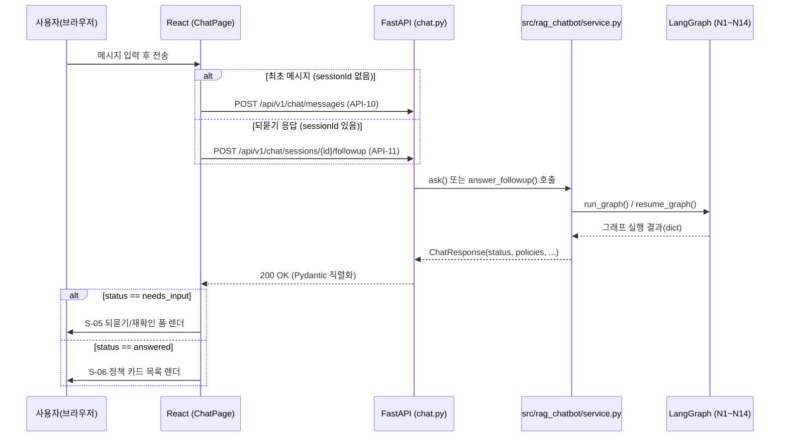

# 복지 에이전트(bokji-agent) — FastAPI + React 마이그레이션 프로젝트 구조 설계서

문서 버전: 2026-09-16 (rev.2 — 신규 디자인시안 반영)
관련 산출물: `API_정의서.xlsx`, `요구사항_정의서.xlsx`
관련 화면설계서: `bokji-screen-design.html` (S-01 ~ S-10, 기능 명세·상호작용 흐름의 기준)
관련 디자인시안: `복지에이전트_디자인시안.html` (최종 적용할 시각 디자인 시스템의 기준 — 아래 0.1 참고)
관련 Gate: Gate 5 (서비스 - 화면, 오류 처리, 보안, 실행 환경 정리) — `docs/PROJECT_COMPLIANCE.md`

## 0.1 참고 문서 두 개의 역할 구분

이번 마이그레이션은 서로 다른 성격의 참고 파일 두 개를 함께 쓴다. 프론트 구현 시 **둘 중 무엇을 봐야 하는지 혼동하지 않도록** 역할을 명확히 나눈다.

| 파일 | 성격 | 프론트 구현에서 쓰는 용도 |
| --- | --- | --- |
| `bokji-screen-design.html` | 화면 목록·상호작용 흐름 와이어프레임(S-01~S-10) | **어떤 화면이 존재하고 어떤 순서로 전환되는지**, 각 화면의 구성 요소·기능 정의의 기준. 요구사항 정의서(`요구사항_정의서.xlsx`)가 이 문서를 그대로 화면 단위로 옮긴 것이다. |
| `복지에이전트_디자인시안.html` | Claude 디자인 캔버스로 만든 실제 목업(Design Component, `.dc.html`) 9장 | **색상·타이포그래피·간격·컴포넌트 모양 등 최종 시각 스타일**의 기준. `frontend/src/styles/theme.css`의 CSS 변수와 각 컴포넌트의 클래스 구조는 이 파일의 아트보드를 그대로 이식한다. |

두 문서가 겹치는 화면(로그인·회원가입·정책 목록/상세/문의/비교·마이페이지)은 **기능은 와이어프레임 기준, 스타일은 디자인시안 기준**으로 구현한다. 디자인시안에 없는 화면(사이드바 검색범위조정 펼침 자체, 슬롯 확인·충돌 재확인 폼 등 대화형 중간 상태)은 같은 디자인 토큰·컴포넌트 언어를 그대로 확장해 만든다 — 별도 시안이 없다고 새 스타일을 임의로 만들지 않는다.

### 디자인시안 아트보드 9장과 화면 매핑

`복지에이전트_디자인시안.html`은 Claude 디자인 캔버스(appifact) 산출물로, 내부에 아트보드 9개(`.dc.html`)를 담고 있다. 각각 와이어프레임 화면 ID와 대응한다.

| 아트보드 파일 | 대응 화면 | 비고 |
| --- | --- | --- |
| `Main.dc.html` | S-01 로그인 (기본 상태) | 좌측 브랜드/통계 영역 + 우측 로그인 카드로 구성된 히어로형 레이아웃. 와이어프레임에는 없던 마케팅 카피·통계 배지가 추가됨(시각 강화, 기능 변경 없음). |
| `States.dc.html` | S-01 로그인의 오류/잠금/로딩 상태 | 아이디·비밀번호 불일치, 계정 잠금(5회 연속 실패), 필수값 누락, 제출 중 4가지 상태를 명시적으로 정의 — 요구사항 정의서 **S01-06**으로 반영했다. |
| `Signup.dc.html` | S-02 회원가입 | 약관 동의를 **[필수] 서비스 이용약관 / [필수] 개인정보 수집·이용 / [선택] 혜택·안내 수신** 3개 체크박스로 명확히 분리 — API 정의서 **API-01**에 `privacy_agreed` 필드로 반영했다. |
| `PolicyList.dc.html` | S-03/S-04/S-06 (사이드바 + 정책 카드 목록) | 사이드바(지원조건·관심분야·정책 후보 수)와 메인 영역(정책 카드·비교 액션바)이 한 화면에 공존 — 실제 구현에서도 `ChatPage.tsx` 하나가 이 레이아웃을 그대로 쓴다. |
| `PolicyDetail.dc.html` | S-07 정책 상세 | AI 요약·지원자격 칩·지원금액/중복수급 카드·추가 확인 필요 항목·관련 법령·구비서류·근거 문서 구성이 `PolicyView`/`PolicyDetail` 필드와 1:1 대응됨을 재확인. |
| `PolicyChatDialog.dc.html` | S-08 정책 문의 다이얼로그 | 정책 상세 화면 위에 뜨는 전용 채팅 다이얼로그. |
| `PolicyCompare.dc.html` | S-10 정책 비교 | 열 단위 비교표 + "다름" 강조, `duplicate_note` 예시("문서에 제한 조항 없음(확정은 아님)")까지 시안에 구체적으로 표현됨. |
| `Mypage.dc.html` | S-09 마이페이지 (조회 모드) | 가입 정보 조회 카드 + **마케팅 수신 동의 여부** 표시(요구사항 정의서 **S09-02**에 반영) + 비밀번호 변경/회원 탈퇴 섹션이 이 화면에 이미 포함되어 있음(요구사항 정의서 S09-05/06과 일치). |
| `MypageEdit.dc.html` | S-09 마이페이지 (수정 모드) | 조회 모드와 별도 아트보드로 분리되어 있으나, 실제로는 같은 `MyPage.tsx`의 view/edit 로컬 상태 전환으로 구현한다(신규 API 없음) — 요구사항 정의서 **S09-04**에 반영. |

디자인시안에 명시적 아트보드가 없는 화면(S-03 초기 인트로·예시 질문, S-04 사이드바 펼침 자체의 단독 상태, S-05 슬롯 확인·충돌 재확인 폼)은 `PolicyList.dc.html`이 보여주는 사이드바+메인 셸(shell) 레이아웃과 동일한 디자인 토큰·컴포넌트를 그대로 확장해 구현한다.

> **미해결 이슈(2026-09-16 스크린샷 검토로 발견)**: `PolicyDetail.dc.html`/`PolicyCompare.dc.html`은 "구비서류"를 신분증·주민등록등본처럼 개별 칩으로 그리지만, 백엔드 계약(`service.py`)의 `detail.required_documents`/`_official`/`_self`는 배열이 아니라 원문 문자열 1개다. 칩 UI를 그대로 구현하려면 파싱 규칙이 필요한데 원천 데이터에 구분자가 보장되지 않는다 - 요구사항 정의서 **S07-06**/**S10-01**에 "보류" 항목으로 남겨뒀고, PM/백엔드가 파싱 규칙을 확정하거나(예: 신뢰 가능한 구분자만 분리) 이번 범위에서는 한 줄 텍스트로만 표시하기로 결정해야 착수할 수 있다.

---

## 0. 마이그레이션 원칙

이 설계는 **기존 저장소에 새 구현 방식을 추가하는 것**이지, 기존 코드를 지우고
다시 만드는 것이 아니다.

1. `src/rag_chatbot/`, `rag_design/`, `data/`, `tests/` 등 기존 파이썬 코어는
   **손대지 않는다.** FastAPI는 이 코어를 그대로 import해서 얇게 감싸는
   어댑터 계층일 뿐이다 - 특히 `src/rag_chatbot/service.py`의
   `ask()` / `answer_followup()` / `ChatResponse` / `PolicyView` 계약,
   `src/rag_chatbot/auth/service.py`의 `sign_up()` / `authenticate()` /
   `update_profile()` 등은 이번 마이그레이션에서 **필드를 지우거나 이름을
   바꾸지 않는다**(다른 브랜치·Streamlit 프론트를 깨뜨림 - `service.py`
   모듈 docstring에 이미 명시된 규칙을 FastAPI 계층에도 그대로 적용한다).
2. `streamlit_ui/`(기존 Streamlit 프론트)는 **삭제하지 않는다.** 새 React
   프론트가 안정화되기 전까지 두 프론트가 같은 `src/rag_chatbot/service.py`를
   같이 바라보며 병행 운영될 수 있다.
3. 신규 코드는 레포 루트에 `backend/`(FastAPI 앱)와 `frontend/`(React 앱)
   두 최상위 폴더로만 추가한다. 기존 폴더 안에 새 프레임워크 코드를 섞어
   넣지 않는다(예: `src/rag_chatbot/` 안에 FastAPI 라우터를 만들지 않는다).
4. API 계약은 `API_정의서.xlsx`, 화면별 기능 요구사항은 `요구사항_정의서.xlsx`를
   단일 출처로 따른다. 이 문서는 그 두 문서를 구현하기 위한 **폴더/파일
   배치도**다.

---

## 1. 전체 레포 트리 (기존 + 신규)

```text
bokji-agent/                                # 기존 레포 루트 - 그대로 유지
├── src/rag_chatbot/                        # ● 기존, 변경 없음 - FastAPI가 그대로 호출하는 코어
│   ├── service.py                          #   ask() / answer_followup() 공개 계약
│   ├── light_followup.py                   #   S-08 정책별 경량 Q&A
│   ├── auth/                               #   sign_up / authenticate / update_profile 등
│   ├── graph/                              #   N1~N14 LangGraph 노드, slot_schema.py
│   └── llm/
├── rag_design/                              # ● 기존, 변경 없음 - 문서/청크/벡터스토어 계약
├── streamlit_ui/                            # ● 기존, 변경 없음 - React 전환 후에도 당분간 병행 운영
├── data/                                    # ● 기존, 변경 없음 - Vector DB, 원천 문서
├── docs/                                    # ● 기존 + 이번 산출물 추가
│   ├── PROJECT_COMPLIANCE.md                #   기존
│   ├── API_정의서.xlsx                      #   ★ 이번 산출물
│   ├── 요구사항_정의서.xlsx                  #   ★ 이번 산출물
│   └── PROJECT_STRUCTURE.md                 #   ★ 이번 산출물(본 문서)
├── tests/                                   # ● 기존, 변경 없음 - N1~N14/서비스 계층 파이썬 테스트
│
├── backend/                                 # ★ 신규 - FastAPI 앱 (아래 2장에서 상세 설명)
│   ├── app/
│   │   ├── main.py
│   │   ├── core/
│   │   ├── api/v1/
│   │   ├── schemas/
│   │   ├── services/
│   │   └── session_store/
│   ├── tests/
│   ├── requirements-backend.txt
│   └── README.md
│
└── frontend/                                # ★ 신규 - React 앱 (아래 3장에서 상세 설명)
    ├── src/
    │   ├── pages/
    │   ├── components/
    │   ├── features/
    │   ├── api/
    │   └── types/
    ├── public/
    ├── package.json
    └── vite.config.ts
```

---

## 2. `backend/` — FastAPI 앱

### 2.1 트리

```text
backend/
├── app/
│   ├── main.py                      # FastAPI() 인스턴스 생성, CORS, 예외 핸들러, 라우터 등록, lifespan
│   ├── core/
│   │   ├── config.py                # Settings(BaseSettings) - .env 로드(HF_TOKEN, LLM_MODEL_NAME 등 기존 변수 재사용)
│   │   ├── security.py              # 세션 쿠키 발급/검증, 비밀번호 정책 래핑
│   │   ├── options.py               # streamlit_ui/constants.py의 옵션 상수를 이관(API-09 단일 출처)
│   │   └── errors.py                # AuthError/GraphExecutionError 등 -> HTTP 상태코드 매핑 (API 정의서 "에러" 표와 1:1)
│   ├── api/
│   │   ├── deps.py                  # get_current_user() 등 공통 Depends
│   │   └── v1/
│   │       ├── auth.py              # API-01~03 (signup/login/logout)
│   │       ├── users.py             # API-04~08 (마이페이지 조회/수정/비밀번호/탈퇴/채팅 프리필)
│   │       ├── config.py            # API-09 (검색 조건 옵션)
│   │       └── chat.py              # API-10~13 (상담 시작/되묻기/정책문의/세션초기화)
│   ├── schemas/                     # Pydantic 요청/응답 모델 - service.py의 TypedDict 계약을 1:1로 옮김
│   │   ├── auth.py                  # SignupRequest, LoginRequest, UserProfile 등
│   │   ├── chat.py                  # ChatRequest, ChatResponse, PolicyView, PolicyDetail (service.py와 필드명 동일하게 유지)
│   │   └── common.py                # ErrorResponse 공통 스키마
│   ├── services/                    # 기존 src.rag_chatbot 계층을 얇게 감싸는 어댑터 (신규 로직 최소화)
│   │   ├── auth_adapter.py          # src.rag_chatbot.auth.service 호출 + 예외->HTTP 매핑
│   │   ├── chat_adapter.py          # src.rag_chatbot.service.ask/answer_followup 호출 + known_* 조립
│   │   └── followup_adapter.py      # src.rag_chatbot.light_followup 호출
│   └── session_store/
│       ├── auth_session.py          # 로그인 세션(session_id ↔ user_id) 저장소 (메모리/Redis)
│       └── chat_session.py          # 채팅 session_id ↔ 로그인 user_id 매핑, 소유권 검증(다른 사용자 세션 접근 차단)
├── tests/                            # FastAPI 전용 테스트 (httpx.AsyncClient/TestClient) - 기존 tests/와 대상이 다름(HTTP 계약 검증)
│   ├── test_auth_api.py
│   ├── test_chat_api.py
│   └── conftest.py
├── requirements-backend.txt          # fastapi, uvicorn, pydantic-settings, httpx(테스트용) 등만 추가 - 기존 requirements-*.txt는 그대로 재사용
└── README.md                         # 백엔드 단독 실행 방법(uvicorn backend.app.main:app --reload)
```

### 2.2 폴더별 역할

| 경로 | 역할 | 들어있어야 할 내용 |
| --- | --- | --- |
| `app/main.py` | 앱 진입점 | `FastAPI()` 생성, `app.include_router(...)`로 `api/v1/*` 라우터 등록, CORS 미들웨어(React 개발 서버 origin 허용), `lifespan` 컨텍스트에서 `service.get_graph()`/`service.get_store()`를 앱 시작 시 1회 호출해 프로세스 전역 캐싱(기존 `service.py`의 캐싱 설계를 FastAPI 생명주기에 맞춰 그대로 재사용) |
| `app/core/config.py` | 환경설정 | 기존 `.env`의 `HF_TOKEN`/`LLM_MODEL_NAME`/`EMBEDDING_PROVIDER` 등을 그대로 읽어 `src.rag_chatbot.service`에 전달할 수 있게 `Settings` 클래스로 감쌈. 새 변수(세션 시크릿, CORS 허용 origin, 세션 TTL)만 추가 |
| `app/core/security.py` | 인증 인프라 | 세션 쿠키 생성/검증(서명된 랜덤 토큰), 로그인 실패 잠금(`auth/lockout.py`)과의 연동. 비밀번호 자체 검증 로직은 새로 만들지 않고 `auth.service`를 호출 |
| `app/core/options.py` | 정적 옵션 단일 출처 | `streamlit_ui/constants.py`의 `SIDO_OPTIONS`/`GENDER_LABELS_KO`/`INCOME_BRACKET_LABELS_KO`/`HOUSEHOLD_TYPE_LABELS_KO`/`INTEREST_OPTIONS`/`SIGNUP_INTEREST_OPTIONS`/`INTEREST_FIELD_OPTIONS`/`DEFAULT_TOP_K`를 그대로 옮기거나 import해서 API-09 응답으로 직렬화 |
| `app/core/errors.py` | 예외 매핑 | `AuthError`/`UsernameTakenError`/`PasswordPolicyError`/`InvalidCredentialsError`/`AccountLockedError`/`UserNotFoundError`(auth 쪽)와 그래프 실행 예외를, `API_정의서.xlsx`의 각 API "Response — 에러" 표에 정의된 HTTP 상태/에러코드로 변환하는 예외 핸들러(`@app.exception_handler`) |
| `app/api/deps.py` | 공통 의존성 | `get_current_user(request) -> AuthUser` - 세션 쿠키를 읽어 `session_store/auth_session.py`에서 사용자 조회, 없으면 401 |
| `app/api/v1/auth.py` | 인증 라우터 | API-01(회원가입) / API-02(로그인) / API-03(로그아웃) 3개 엔드포인트 |
| `app/api/v1/users.py` | 사용자 라우터 | API-04(마이페이지 조회) / API-05(수정) / API-06(비밀번호 변경) / API-07(탈퇴) / API-08(채팅 프리필) 5개 엔드포인트 |
| `app/api/v1/config.py` | 설정 라우터 | API-09(검색 조건 옵션) 1개 엔드포인트 |
| `app/api/v1/chat.py` | 채팅 라우터 | API-10(상담 시작) / API-11(되묻기) / API-12(정책 문의) / API-13(세션 초기화) 4개 엔드포인트 |
| `app/schemas/*.py` | 요청/응답 검증 | `service.py`의 `ChatResponse`/`PolicyView`/`PolicyDetail` `TypedDict`를 Pydantic `BaseModel`로 1:1 변환. **필드명·타입을 반드시 원본과 동일하게 유지**(프론트 타입 생성 시 어긋나면 안 됨) |
| `app/services/chat_adapter.py` | 그래프 호출 어댑터 | `from src.rag_chatbot.service import ask, answer_followup`를 그대로 호출하고, `ChatRequest`(Pydantic) → 함수 인자, 함수 반환 `ChatResponse`(dict) → Pydantic 모델로 변환만 담당. **새 비즈니스 로직을 여기서 만들지 않는다** |
| `app/services/auth_adapter.py` | 인증 호출 어댑터 | `from src.rag_chatbot.auth import service as auth_service`를 그대로 호출. DB 경로(`db_path`)는 `app/core/config.py`의 설정값을 주입 |
| `app/services/followup_adapter.py` | 정책 문의 어댑터 | `from src.rag_chatbot.light_followup import respond_to_policy_question`을 호출. `session_store/chat_session.py`에서 해당 `session_id`의 마지막 `policies` 배열을 조회해 `policy_id`가 일치하는 항목을 찾아 전달 |
| `app/session_store/auth_session.py` | 로그인 세션 저장 | `session_id -> user_id` 매핑. 초기 구현은 서버 메모리(dict)도 가능하나, 다중 프로세스/재시작 대비 Redis 등 외부 저장소 전환을 고려한 인터페이스로 설계 |
| `app/session_store/chat_session.py` | 채팅 세션 소유권 관리 | LangGraph의 `session_id`(=thread_id)가 어떤 로그인 사용자 소유인지 기록해, API-11/12/13에서 **다른 사용자의 채팅 세션에 접근하지 못하도록** 검증(현재 코드베이스에 없는 신규 보안 요구사항 - 비고 참고) |
| `tests/` | HTTP 계약 테스트 | 실제 `service.ask()`를 호출하는 통합 테스트보다는, `chat_adapter`를 모킹한 라우팅/스키마/에러코드 단위 테스트 위주로 구성(무거운 그래프 실행은 기존 `tests/`가 이미 담당) |

### 2.3 신규로 반드시 구현해야 하는 것 (기존 코드에 없음)

- **세션 관리 전체**(`session_store/*`, `core/security.py`): 기존 Streamlit은 `st.session_state`로
  프로세스 안에서 상태를 들고 있었지만, REST API는 무상태이므로 로그인 세션과
  채팅 세션(`session_id`)을 서버가 명시적으로 저장·검증해야 한다.
- **API-13(세션 초기화)**: LangGraph `MemorySaver` 체크포인터에서 특정 `session_id`
  항목을 지우는 함수가 현재 `src/rag_chatbot/service.py`에 없다. `chat_adapter.py`에서
  그래프 객체(`get_graph()`)의 체크포인터에 직접 접근해 구현해야 한다.
- **채팅 세션 소유권 검증**: 기존 코드는 단일 Streamlit 프로세스 내 단일 사용자
  전제라 이 개념이 없었다. REST API는 여러 사용자가 동시에 접속하므로,
  다른 사람의 `session_id`를 추측해 이어 쓰는 것을 막는 검증이 새로 필요하다.

---

### 2.4 LLM 백엔드 선택 — RunPod Pod / 로컬(기존 경로) 자동 전환

**요청 배경**: LLM 추론은 RunPod에서 GPU **Pod**(영구 인스턴스)를 대여해 직접 띄운 추론 서버(예: vLLM의 OpenAI 호환 서버)로 돌릴 예정이다. `.env`에 그 Pod의 ID가 있으면 그 Pod를 쓰고, 없으면 지금까지 쓰던 방식(로컬 프로세스가 HuggingFace Inference API를 직접 호출하는 기존 경로)으로 조용히 폴백한다.

> ⚠ 이 절은 "기존 코드에 손대지 않는다"(0장 원칙)의 **의도적 예외**다. RunPod Pod 연동은 기존 코드에 없던 새 기능이라 `src/rag_chatbot/llm/client.py`(신규 클래스 추가)와 `src/rag_chatbot/service.py::build_llm_client()`(분기 추가) 두 기존 파일을 실제로 수정해야 한다. FastAPI 계층(`backend/`)에는 이 로직을 두지 않는다 — Streamlit도 같은 `build_llm_client()`를 호출하므로, 여기서 한 번만 고치면 두 프론트 모두에 적용된다.

**RunPod 제품 구분 (혼동 주의)**: 이 저장소에는 이미 `RunPodServerlessClient`(`RUNPOD_ENDPOINT_ID`/`RUNPOD_API_KEY` 기반, `POST /v2/{endpoint_id}/runsync` 호출)가 있는데, 이건 **RunPod Serverless**(요청당 과금, `docs/RUNPOD_SETUP_DRAFT.md` 참고)이고 이번에 쓰려는 **RunPod Pod**(시간당 과금으로 켜두는 영구 GPU 인스턴스)와는 다른 제품·다른 API 규격이다. 그래서 기존 클래스를 재사용하지 않고 `RunPodPodClient`를 새로 추가한다.

**신규 환경변수** (`.env`/`.env.example`에 추가):

| 변수 | 필수 여부 | 설명 |
| --- | --- | --- |
| `RUNPOD_POD_ID` | 이 값이 있어야 RunPod 경로가 켜짐 | RunPod 콘솔에서 대여한 Pod의 ID. **이 변수의 존재 여부가 곧 스위치**다 - 값이 없으면 아래 "로컬(기존 경로)"로 폴백하고, 있으면 `LLM_BACKEND` 값과 무관하게 최우선으로 RunPod Pod를 쓴다. |
| `RUNPOD_POD_PORT` | 선택, 기본값 `8000` | Pod에 노출해 둔 추론 서버 포트(vLLM OpenAI 호환 서버 기본값 8000). |
| `RUNPOD_POD_API_KEY` | 선택 | Pod 위에 띄운 추론 서버 자체가 인증을 요구할 때만 사용. RunPod 계정 API 키(`RUNPOD_API_KEY`, Serverless용)와는 **다른 값**이니 변수명을 분리해 혼동을 막는다. |
| `LLM_MODEL_NAME` | 기존 변수 재사용 | 어떤 백엔드를 쓰든 모델 이름은 이 변수 하나로 통일(이미 HF 경로가 이렇게 쓰고 있음). |

**선택 로직** (`src/rag_chatbot/service.py::build_llm_client()` 최상단에 추가):

```python
def build_llm_client() -> RecordingLLMClient | None:
    pod_id = os.environ.get("RUNPOD_POD_ID")
    if pod_id:
        # .env에 Pod ID가 있으면 LLM_BACKEND 값과 무관하게 RunPod Pod를 최우선 사용
        return RecordingLLMClient(
            RunPodPodClient(
                pod_id=pod_id,
                timeout_seconds=float(os.environ.get("LLM_TIMEOUT_SECONDS") or 120.0),
            )
        )
    # RUNPOD_POD_ID가 없으면 로컬(기존 경로) 그대로 - 아래는 기존 코드 유지
    backend = (os.environ.get("LLM_BACKEND") or "hf").strip().lower()
    ...  # 기존 hf / runpod(Serverless) 분기는 그대로 둔다
```

**신규 클래스** (`src/rag_chatbot/llm/client.py`에 `RunPodServerlessClient` 옆에 추가, 같은 `LLMClient` 인터페이스 - `complete(prompt, *, system=None, max_tokens=None) -> str`):

```python
class RunPodPodClient:
    """RunPod에서 대여한 Pod(영구 GPU 인스턴스)에 직접 띄운 OpenAI 호환
    추론 서버(vLLM 등)를 호출한다. RunPodServerlessClient(과금형 Serverless
    엔드포인트, /v2/{id}/runsync)와는 별개 제품이니 혼동하지 말 것 - 이쪽은
    Pod의 공개 프록시 URL로 OpenAI 호환 /v1/chat/completions를 직접 부른다.
    """

    def __init__(
        self,
        pod_id: str | None = None,
        *,
        port: int | None = None,
        model: str | None = None,
        api_key: str | None = None,
        timeout_seconds: float = 60.0,
    ):
        self.pod_id = pod_id or os.environ.get("RUNPOD_POD_ID", "")
        self.port = int(port or os.environ.get("RUNPOD_POD_PORT") or 8000)
        self.model = model or os.environ.get("LLM_MODEL_NAME", "")
        self.api_key = api_key or os.environ.get("RUNPOD_POD_API_KEY", "")
        self.timeout_seconds = timeout_seconds
        if not self.pod_id:
            raise ValueError("RunPodPodClient에는 pod_id가 필요합니다 (RUNPOD_POD_ID).")

    def complete(self, prompt: str, *, system: str | None = None, max_tokens: int | None = None) -> str:
        import requests
        from .client import LLMCallError  # 기존 예외 재사용

        url = f"https://{self.pod_id}-{self.port}.proxy.runpod.net/v1/chat/completions"
        headers = {"Content-Type": "application/json"}
        if self.api_key:
            headers["Authorization"] = f"Bearer {self.api_key}"
        messages = []
        if system:
            messages.append({"role": "system", "content": system})
        messages.append({"role": "user", "content": prompt})
        payload = {"model": self.model, "messages": messages}
        if max_tokens:
            payload["max_tokens"] = max_tokens
        try:
            response = requests.post(url, json=payload, headers=headers, timeout=self.timeout_seconds)
            response.raise_for_status()
            return response.json()["choices"][0]["message"]["content"]
        except (requests.RequestException, KeyError, IndexError) as exc:
            raise LLMCallError(f"RunPod Pod 호출 실패: {exc}") from exc
```

**주의(팀이 실제 Pod를 띄운 뒤 확인할 것, 미확인 항목)**:
- `https://{pod_id}-{port}.proxy.runpod.net` 프록시 URL 패턴은 RunPod의 일반적인 Pod HTTP 포트 노출 방식을 근거로 적었다 - 실제 콘솔에서 발급되는 URL과 다를 수 있으니 Pod를 띄운 뒤 콘솔에 표시되는 실제 프록시 주소로 교체 확인할 것.
- Pod 위에 무엇을 띄우느냐(vLLM/TGI/커스텀 서버)에 따라 `/v1/chat/completions` 경로와 응답 JSON 모양이 다를 수 있다 - OpenAI 호환 서버가 아니면 `complete()`의 payload/파싱 부분을 그 서버 스펙에 맞게 고쳐야 한다.
- Pod는 Serverless와 달리 **켜두는 동안 계속 과금**되므로, 안 쓸 때 꺼두는 운영 정책(수동/스케줄러)은 이 문서 범위 밖이며 팀이 별도로 정해야 한다.

**FastAPI 계층에서 달라지는 것은 없음**: `backend/app/services/chat_adapter.py`는 여전히 `src.rag_chatbot.service.ask()`를 그대로 호출할 뿐이고, 어떤 LLM 백엔드가 실제로 붙었는지는 응답의 `llm_status.model` 값(이미 `ChatResponse` 계약에 있는 필드)으로 프론트에 그대로 노출된다 - API 정의서(API-10/API-11)의 `llm_status` 필드 설명을 그대로 재사용하면 되고 별도 API 변경은 없다.

## 3. `frontend/` — React 앱

### 3.1 트리

```text
frontend/
├── src/
│   ├── main.tsx                     # ReactDOM.createRoot, 전역 Provider(QueryClient, Router) 마운트
│   ├── App.tsx                      # react-router 라우트 정의(아래 3.3 화면-라우트 매핑표)
│   ├── pages/                       # 화면 단위 - S-01~S-10과 1:1 대응(아래 3.3 참고)
│   │   ├── LoginPage.tsx            # S-01 (기본/오류/잠금/로딩 상태 포함 - 디자인시안 Main+States 아트보드)
│   │   ├── SignupPage.tsx           # S-02
│   │   ├── ChatPage.tsx             # S-03/04/05/06/07/10 (같은 화면 내부 상태 전환 - 아래 3.4 참고)
│   │   └── MyPage.tsx               # S-09 (조회/수정 두 로컬 모드 - 디자인시안 Mypage+MypageEdit 아트보드)
│   ├── components/
│   │   ├── chat/
│   │   │   ├── ChatBubble.tsx
│   │   │   ├── ExamplePrompts.tsx           # S-03 예시 질문 버튼
│   │   │   ├── SearchScopeSidebar.tsx       # S-04 지원조건/관심분야/top_k 슬라이더
│   │   │   ├── SlotFollowupForm.tsx         # S-05 되묻기 폼
│   │   │   ├── SlotConflictForm.tsx         # S-05 회원정보-채팅 충돌 재확인 폼
│   │   │   ├── PolicySummaryStats.tsx       # S-06 통계 타일
│   │   │   ├── PolicyCard.tsx               # S-06 정책 카드
│   │   │   ├── PolicyDetailView.tsx         # S-07 정책 상세
│   │   │   ├── PolicyCompareTable.tsx       # S-10 비교표
│   │   │   └── LlmDebugPanel.tsx            # S-05 "AI 분석 적용" 배지·응답 원문 보기(선택 노출)
│   │   ├── layout/
│   │   │   ├── AppShell.tsx                 # 공통 헤더/레이아웃
│   │   │   └── Sidebar.tsx                  # S-03 좌측 사이드바(마이페이지/로그아웃/새 상담)
│   │   ├── dialogs/
│   │   │   └── PolicyQuestionDialog.tsx     # S-08 정책 문의 다이얼로그
│   │   └── common/
│   │       ├── PillMultiSelect.tsx          # 지원조건/관심분야/가구유형 등 다중선택 pill 공통 컴포넌트
│   │       └── ConfirmModal.tsx             # 회원 탈퇴 등 위험 액션 확인 모달
│   ├── features/                    # 도메인별 상태·훅 (TanStack Query 기준)
│   │   ├── auth/
│   │   │   ├── useAuth.ts                   # 로그인 상태 전역 관리, useLogin/useSignup/useLogout 훅
│   │   │   └── useMyPage.ts                 # useProfile/useUpdateProfile/useChangePassword/useDeleteAccount
│   │   ├── chat/
│   │   │   ├── useChatSession.ts            # session_id 상태, sendMessage(최초 API-10/이후 API-11 자동 분기)
│   │   │   ├── usePolicySelection.ts        # S-06 비교 선택 로컬 상태
│   │   │   └── usePolicyQuestion.ts         # S-08 API-12 호출 훅
│   │   └── config/
│   │       └── useSearchOptions.ts          # API-09 결과 캐싱(react-query staleTime 길게)
│   ├── api/                         # HTTP 클라이언트 - API_정의서.xlsx의 API ID와 1:1 대응하는 함수
│   │   ├── client.ts                        # axios 인스턴스(withCredentials: true, baseURL)
│   │   ├── authApi.ts                       # API-01,02,03
│   │   ├── userApi.ts                       # API-04~08
│   │   ├── configApi.ts                     # API-09
│   │   └── chatApi.ts                       # API-10~13
│   ├── types/                       # 백엔드 Pydantic 스키마와 대응하는 TS 타입(수동 또는 openapi-typescript로 생성)
│   │   ├── auth.ts
│   │   └── chat.ts                          # PolicyView, PolicyDetail, ChatResponse 등 - 필드명 백엔드와 100% 일치
│   ├── constants/
│   │   └── labels.ts                        # 슬롯 코드->한글 라벨 등, API-09 값을 기본으로 쓰되 로딩 전 폴백용 하드코딩 보관
│   └── styles/
│       └── theme.css                        # 복지에이전트_디자인시안.html의 CSS 변수 이식(아래 표) - bokji-screen-design.html의 색상은 참고만 하고 최종 채택하지 않는다
├── public/
├── package.json
├── tsconfig.json
└── vite.config.ts
```

### 3.2 폴더별 역할

| 경로 | 역할 | 비고 |
| --- | --- | --- |
| `pages/` | 라우트 단위 화면 | 화면설계서는 10개 화면이지만, S-03/04/05/06/07/10은 "같은 채팅 답변 영역 안에서 상태만 바뀌는 하나의 뷰"(화면설계서 S-10 관련 기능 메모)이므로 페이지 컴포넌트는 4개로 충분하다 |
| `components/chat/` | 채팅 관련 프레젠테이션 컴포넌트 | 화면설계서의 "구성 요소" 표 항목과 거의 1:1 대응되도록 세분화해, 요구사항 정의서의 요구사항ID(S0X-XX) 단위로 테스트/리뷰가 가능하게 한다 |
| `components/dialogs/PolicyQuestionDialog.tsx` | S-08 | `dismissible=false` 동작(바깥 클릭으로 안 닫힘)을 컴포넌트 레벨에서 강제 |
| `features/*/use*.ts` | 서버 상태 훅 | TanStack Query(react-query) 기준 - 서버 데이터(프로필, 옵션, 채팅 응답)와 로컬 UI 상태(비교 선택, 다이얼로그 오픈 여부)를 명확히 분리 |
| `api/*.ts` | API 호출 함수 | 파일당 `API_정의서.xlsx`의 관련 API 그룹과 대응(`authApi.ts` = API-01~03 등) - 함수명에 API ID를 주석으로 남겨 추적성 확보 |
| `types/chat.ts` | 타입 정의 | `PolicyView`/`ChatResponse`의 필드명을 `src/rag_chatbot/service.py`와 `backend/app/schemas/chat.py`에 정확히 맞춘다 - 세 곳(파이썬 TypedDict/Pydantic/TS 타입)의 필드명이 어긋나면 런타임에서만 발견되는 버그가 된다 |

### 3.2.1 `theme.css` 디자인 토큰 (복지에이전트_디자인시안.html 이식)

디자인시안 9개 아트보드가 공유하는 CSS 변수를 `:root`에 그대로 옮긴다 - 아트보드마다 변수 이름이 살짝 다르게 선언돼 있어(예: `PolicyList.dc.html`은 `--sidebar-bg`, `Main.dc.html`은 `--sky-1/2/3`), 프론트 구현 시 아래처럼 하나의 토큰 세트로 통합한다.

| 토큰 | 값 | 용도 |
| --- | --- | --- |
| `--primary` | `#3D63D8` | 주요 버튼·강조 텍스트·포커스 링 (기존 Streamlit `#4F46E5` 인디고에서 블루 계열로 변경) |
| `--primary-hover` | `#2F4FC0` | 버튼 hover |
| `--primary-soft` | `#EAF0FF` | 포커스 박스섀도·hover 배경 |
| `--bg` | `#FCFCFD` | 페이지 배경 |
| `--panel` | `#FFFFFF` | 카드·입력창 배경 |
| `--sidebar-bg` | `#F7F8FC` (그라디언트 `--sky-1 #BFDBFF → --sky-2 #DCEBFF → --sky-3 #F2F7FF`) | 사이드바·히어로 배경 |
| `--text` / `--text-muted` / `--text-faint` | `#1E2233` / `#5B6072` / `#8A8FA3` | 본문/보조/희미한 텍스트 3단계 |
| `--border` / `--border-strong` | `#E4E6EF` / `#D8DBE8` | 구분선/입력창 테두리 |
| `--green` / `--green-bg` / `--green-text` | `#059669` / `#D1FAE5` / `#065F46` | "충족" 배지 |
| `--amber`(`--warn`) / `--amber-bg` / `--amber-text` | `#D97706` / `#FEF3C7` / `#92400E` | "미확인"/경고 배지, 계정 잠금 배너 |
| `--red`(`--error`) / `--red-bg` / `--red-text` | `#DC2626` / `#FEE2E2` / `#991B1B` | "미충족"/오류 배지, 로그인 실패 배너 |
| `--gray-bg` / `--gray-text` | `#EEF1F6` / `#475569` | 중립 칩(구비서류 등) |

폰트는 전 아트보드 공통으로 Google Fonts `Noto Sans KR`(400/500/600/700/800)을 쓴다. `frontend/index.html`에 `<link>`로 추가하거나 `@fontsource/noto-sans-kr` 패키지로 번들링한다(디자인시안은 CDN `<link>` 방식을 씀 - 오프라인/사내망 배포 시에는 번들링 권장).

### 3.3 화면 - 라우트 매핑

| 화면 ID | 화면명 | 라우트 경로(예시) | 페이지 컴포넌트 |
| --- | --- | --- | --- |
| S-01 | 로그인 | `/login` | `LoginPage.tsx` |
| S-02 | 회원가입 | `/signup` | `SignupPage.tsx` |
| S-03 | 채팅 메인(초기) | `/chat` | `ChatPage.tsx` (message 배열이 비어있는 상태) |
| S-04 | 사이드바 검색범위조정 | `/chat` (동일 라우트, 사이드바 펼침 상태) | `ChatPage.tsx` 내부 `SearchScopeSidebar` |
| S-05 | 슬롯확인/충돌재확인 | `/chat` (동일 라우트, 마지막 메시지 status=needs_input) | `ChatPage.tsx` 내부 `SlotFollowupForm`/`SlotConflictForm` |
| S-06 | 결과요약/정책카드 | `/chat` (동일 라우트, view=list) | `ChatPage.tsx` 내부 `PolicyCard` 그리드 |
| S-07 | 정책상세 | `/chat` (동일 라우트, view=detail, selectedPolicyId) | `ChatPage.tsx` 내부 `PolicyDetailView` |
| S-08 | 정책문의 다이얼로그 | (라우트 없음 - `/chat` 위에 뜨는 오버레이) | `PolicyQuestionDialog.tsx` |
| S-09 | 마이페이지 | `/mypage` | `MyPage.tsx` |
| S-10 | 정책비교 | `/chat` (동일 라우트, view=compare) | `ChatPage.tsx` 내부 `PolicyCompareTable` |

### 3.4 `ChatPage.tsx` 내부 상태 전환 (S-03~S-07, S-10)

화면설계서 원문 그대로: *"목록(S-06)·상세(S-07)·비교(S-10)는 별개 화면이 아니라,
같은 채팅 답변 영역 안에서 상태만 바뀌는 하나의 3-단계 뷰"* — 기존 Streamlit의
`streamlit_ui/rendering.py::_render_policy_section`이 이 역할을 했으므로,
React에서는 `ChatPage.tsx`가 아래와 같은 로컬 상태 하나로 같은 개념을 구현한다.

```text
ChatPage 상태
├── messages: ChatTurn[]              # 대화 이력(사용자 발화 + status/answered 응답)
├── sessionId: string | null          # API-10 최초 호출 후 발급, API-11/12/13에서 재사용
├── policyView: "list" | "detail" | "compare"
├── selectedPolicyId: string | null   # detail 뷰에서 사용
└── comparePolicyIds: string[]        # compare 뷰에서 사용(S-06 체크박스로 누적)
```

- 최초 진입(메시지 없음) → S-03 렌더
- `sendMessage()` 호출 → 응답 `status`로 분기: `needs_input`(`slot_conflicts` 유무로 S-05의
  두 하위 폼 중 선택) / `answered`(`policyView="list"`로 전환, S-06 렌더)
- S-06에서 카드 클릭 → `policyView="detail"` (S-07)
- S-06에서 2개 이상 체크 후 "비교하기" → `policyView="compare"` (S-10)
- 이 전환들은 **API 재호출을 하지 않는다** - 같은 `ChatResponse.policies` 배열을 그대로 재사용한다.

---

## 4. 상담 요청 처리 흐름 (API-10/11 기준)



---

## 5. 실행 방법 개요

| 구성 | 실행 명령(예시) | 비고 |
| --- | --- | --- |
| 기존 Streamlit(병행 운영) | `streamlit run app.py` | 변경 없음 |
| FastAPI 백엔드 | `uvicorn backend.app.main:app --reload --port 8000` | `PYTHONPATH=.` 필요(레포 루트에서 실행, 기존 관례와 동일) |
| React 프론트 | `cd frontend && npm run dev` | Vite 개발 서버, `VITE_API_BASE_URL=http://localhost:8000` 환경변수로 백엔드 연결 |

---

## 6. 이번 설계에서 의도적으로 만들지 않은 것

- **정책 상세 전용 조회 API**: `API_정의서.xlsx` API-10/11 비고에 명시했듯, 상세 화면(S-07)에
  필요한 7개 섹션이 이미 `PolicyView.detail`에 포함되어 오므로 별도 엔드포인트·페이지 라우트를
  만들지 않는다.
- **정책 비교 전용 API**: S-10은 프론트 로컬 상태(`comparePolicyIds`)로만 구현되고 서버 API가 없다.
- **정책 문의(S-08) 히스토리 서버 저장**: 다이얼로그를 닫으면 소실되는 것이 현재 범위의 의도된
  한계다(요구사항 정의서 S08-04 비고 참고). 필요해지면 `chat_session.py`에 정책별 히스토리를
  추가하는 후속 작업으로 확장한다.
